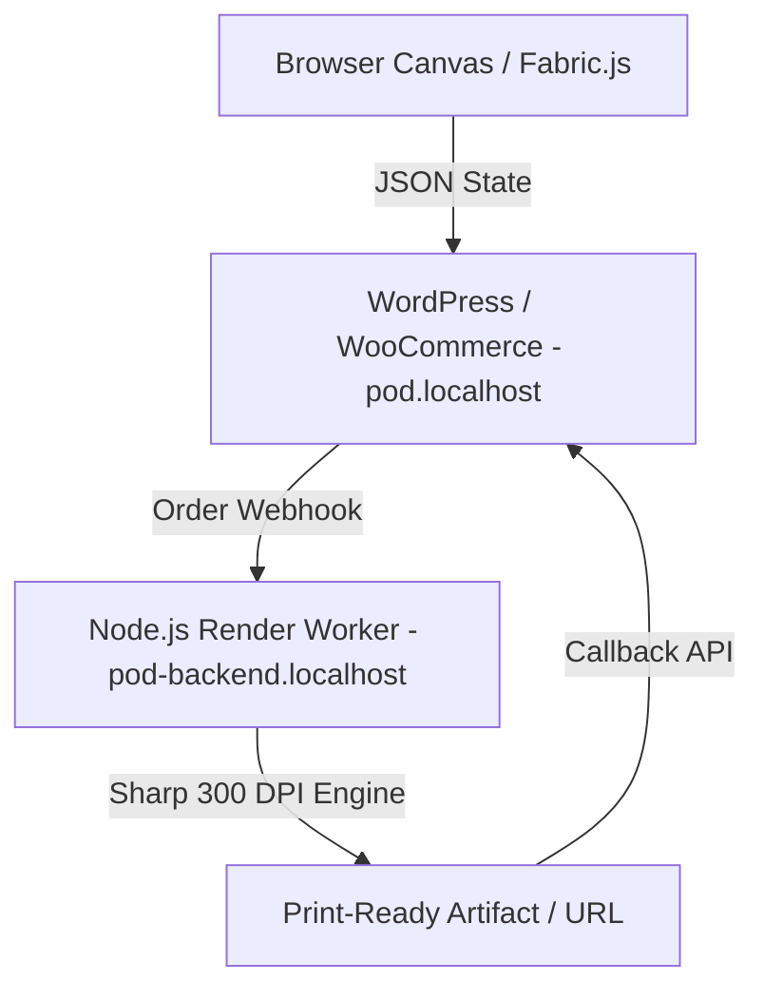

# Project Constitution - POD Personalization System

---
title: "Constitution"
updated_at: 2026-09-16T00:00:00Z
updated_by: Antigravity
version: 1.0
---

This constitution contains the mandatory rules for requirements, architecture, implementation, testing, and quality assurance for the POD (Print on Demand & Personalization) project.

These rules apply to all developers, reviewers, and AI agents.

---

## 1. Requirements as Source of Truth

The approved specification files located in `.specify/` are the authoritative source of truth for this project.

1. **Strict Adherence**: Source code must strictly implement the requirements approved in `.specify/`.
2. **Prohibition of Silent Deviations**: Developers and AI agents may NOT silently:
   - Invent missing functionality without documentation;
   - Alter approved workflows (e.g. Canvas preview -> Order metadata -> Webhook -> Backend render -> Order update);
   - Introduce shortcuts or dummy fallback logic (`val || fallback`) that conceal underlying data issues;
   - Bypass established architecture boundaries (e.g., executing heavy 300 DPI graphics rendering inside PHP-FPM).
3. **Escalation**: Any ambiguity, conflicting constraints, or missing definitions must be captured in `.specify/` as open questions and approved before code execution continues.

---

## 2. Architectural Boundary & Separation of Concerns

The project consists of two strictly decoupled components:

1. **WordPress / WooCommerce (`pod.localhost`)**:
   - Acts strictly as the e-commerce storefront, user interaction orchestrator, and order manager.
   - Enqueues lightweight client-side scripts (Canvas Live Preview, 72 DPI).
   - Collects customer personalization parameters (text, clipart IDs, selected colors, uploaded images) and serializes them into structured JSON in cart and order item metadata.
   - Triggers asynchronous webhooks when orders transition to `processing`.
2. **Backend Render Engine (`pod-backend.localhost`)**:
   - Acts strictly as the graphic processing engine and print-file generator.
   - Uses Node.js with high-performance C++ bindings (`sharp`, `canvas`) to render high-resolution 300 DPI print-ready files (PNG/PDF).
   - Manages asynchronous queues to protect server memory and CPU from spikes.
   - Communicates status and file links back to WordPress via secure REST API callbacks.

---

## 3. PHP & WordPress Plugin Development Standards

### 3.1 DRY (Don't Repeat Yourself)
- Redundant logic across hooks, admin settings, and REST controllers is prohibited.
- Common utilities (sanitization, JSON serialization, HTTP dispatching, logging) must be encapsulated in dedicated helper services, traits, or contract implementations.

### 3.2 SOLID Principles
- **Single Responsibility Principle (SRP)**: Each class must have one responsibility (e.g., `CartHandler` only handles cart item session data; `OrderHandler` only handles order item metadata; `WebhookDispatcher` only handles HTTP requests to the backend worker).
- **Open/Closed Principle (OCP - Extensibility)**: Classes and workflows must be open for extension via standard WordPress actions (`do_action`) and filters (`apply_filters`), but closed for invasive modification of core classes.
- **Liskov Substitution Principle (LSP)**: Any service or adapter implementing a contract interface must be freely swappable without breaking client code.
- **Interface Segregation Principle (ISP)**: Interfaces must remain fine-grained and focused (e.g., `RenderPayloadInterface`, `OrderMetaSyncInterface`).
- **Dependency Inversion Principle (DIP)**: High-level business flows must depend on abstract service contracts, coordinated via a lightweight Service Container or dependency injection.

### 3.3 Strict WordPress Coding Standards (WPCS & PSR-12)
- Fully object-oriented structure adhering to PSR-4 autoloading under the namespace `PodCustomizer\`.
- All user inputs must be strictly validated and sanitized (`sanitize_text_field`, `wp_unslash`).
- All admin actions and form submissions must be secured with `check_admin_referer` and nonces (`wp_verify_nonce`).
- All capabilities must be explicitly verified (`current_user_can('manage_options')` or `current_user_can('edit_shop_orders')`).

---

## 4. Strict Data Contracts & No Fallbacks

1. **No Dummy Fallbacks**: Code must never use superficial fallback chains (e.g. `val || fallback`, `a ?? b ?? default`) to mask undefined schema fields or malformed payloads.
2. **Strict Schema Validation**: The Canvas state JSON payload generated by the frontend must validate against a predefined schema before being accepted into the cart and before dispatching to the render engine.
3. **Fix at Source**: When an attribute is missing or misnamed, rectify the producing layer rather than patching consuming layers with permissive fallback defaults.
4. **Canonical Entities & Schema Definition**: All entities, metadata keys, and database tables must strictly align with the canonical specification in [`.specify/entities_and_database.md`](./entities_and_database.md).

---

## 5. Requirement & Specification Lifecycle

All features must follow the standard Spec-Kit phase lifecycle:
1. `DRAFT`: Initial draft under discussion.
2. `READY_FOR_REVIEW`: Complete requirements, diagrams, and AI verification contracts.
3. `APPROVED_FOR_DEVELOPMENT`: Explicitly approved for code implementation.
4. `IMPLEMENTED`: Code written, automated test suite passes.
5. `VERIFIED`: Dev and AI verification completed on live Docker containers.
