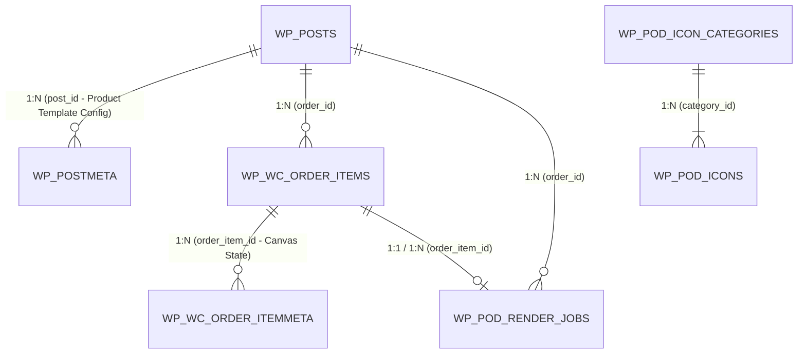

# Database Schema & Storage Architecture Specification

---
title: "Database Tables, Storage Architecture & Schema Specification"
updated_at: 2026-09-18T10:00:00Z
updated_by: Antigravity
status: APPROVED_FOR_DEVELOPMENT
version: 1.2
reference_entities: "entities.md"
---

Tài liệu này chuẩn hóa toàn bộ cấu trúc bảng cơ sở dữ liệu (**Database Tables**), mối quan hệ khóa ngoại (**Foreign Keys & Indices**), và cơ chế lưu trữ dữ liệu (**Storage Architecture**) trong MySQL 8.4 của hệ thống POD Personalization.

Định nghĩa chi tiết các thực thể nghiệp vụ (Domain Entities) xem tại [**`entities.md`**](entities.md).

---

## 1. Bản Đồ Quan Hệ Cơ Sở Dữ Liệu (Database ERD)

Hệ thống POD kết nối chặt chẽ giữa các bảng chuẩn của WooCommerce/WordPress Core và các bảng Custom của Plugin:



---

## 2. Quy Tắc Đặt Tên Bảng & Ràng Buộc (Table Naming & Conventions)

1. **Tiền tố bắt buộc (Prefix Convention)**:
   - Mọi bảng custom của plugin bắt buộc sử dụng tiền tố động của WordPress: `{$wpdb->prefix}pod_*`.
   - Trong PHP, luôn gọi thông qua `$wpdb->prefix . 'pod_...'` để đảm bảo tương thích đa tiền tố hoặc môi trường WordPress Multisite (`wp_2_pod_...`).
2. **Hệ mã hóa & Collation**:
   - `DEFAULT CHARSET=utf8mb4 COLLATE=utf8mb4_unicode_ci` trên tất cả các bảng để hỗ trợ 100% tiếng Việt có dấu, ký tự đặc biệt và Emoji.
3. **Ràng buộc Khóa Ngoại (Foreign Key Constraints)**:
   - Sử dụng `ON DELETE CASCADE` cho các thực thể phụ thuộc (Ví dụ: khi xóa Category thì xóa toàn bộ Icon con; khi xóa Order Item thì xóa Render Job liên quan).

---

## 3. Chi Tiết Các Bảng Tùy Biến (Custom Plugin Tables)

### 3.1 Bảng Quản Lý Nhóm Icon: `{$wpdb->prefix}pod_icon_categories`
Lưu trữ danh mục gom nhóm các biểu tượng/clipart dùng chung trong toàn hệ thống.

```sql
CREATE TABLE IF NOT EXISTS `{$wpdb->prefix}pod_icon_categories` (
    `id` BIGINT UNSIGNED AUTO_INCREMENT PRIMARY KEY,
    `name` VARCHAR(255) NOT NULL COMMENT 'Tên hiển thị nhóm icon (VD: 12 Cung Hoàng Đạo, Giống Chó Cưng)',
    `slug` VARCHAR(100) NOT NULL COMMENT 'Mã định danh duy nhất (VD: zodiac_signs, pet_dogs)',
    `description` TEXT NULL COMMENT 'Mô tả ghi chú của Admin',
    `sort_order` INT NOT NULL DEFAULT 0 COMMENT 'Thứ tự ưu tiên hiển thị trong Admin',
    `is_active` TINYINT(1) NOT NULL DEFAULT 1 COMMENT '1: Kích hoạt, 0: Vô hiệu hóa',
    `created_at` DATETIME DEFAULT CURRENT_TIMESTAMP,
    `updated_at` DATETIME DEFAULT CURRENT_TIMESTAMP ON UPDATE CURRENT_TIMESTAMP,
    
    -- Chỉ mục tra cứu
    UNIQUE KEY `uk_pod_category_slug` (`slug`),
    INDEX `idx_pod_category_status` (`is_active`, `sort_order`)
) ENGINE=InnoDB DEFAULT CHARSET=utf8mb4 COLLATE=utf8mb4_unicode_ci;
```

---

### 3.2 Bảng Quản Lý Từng Icon: `{$wpdb->prefix}pod_icons`
Lưu trữ từng biểu tượng chi tiết với 2 phiên bản hình ảnh (Thumbnail web và Print 300 DPI xưởng in).

```sql
CREATE TABLE IF NOT EXISTS `{$wpdb->prefix}pod_icons` (
    `id` BIGINT UNSIGNED AUTO_INCREMENT PRIMARY KEY,
    `category_id` BIGINT UNSIGNED NOT NULL COMMENT 'Khóa ngoại tham chiếu bảng pod_icon_categories',
    `title` VARCHAR(255) NOT NULL COMMENT 'Tên hiển thị cho khách xem (VD: Bạch Dương, Chó Corgi)',
    `slug` VARCHAR(100) NOT NULL COMMENT 'Mã định danh icon trong category (VD: aries, corgi_01)',
    `thumbnail_url` VARCHAR(500) NOT NULL COMMENT 'URL ảnh thu nhỏ nhẹ (SVG/PNG 72 DPI) cho bảng chọn web',
    `print_url` VARCHAR(500) NOT NULL COMMENT 'URL ảnh gốc chất lượng cao chuẩn 300 DPI Transparent cho xưởng in',
    `is_vector` TINYINT(1) NOT NULL DEFAULT 0 COMMENT '1: SVG vector, 0: PNG raster',
    `sort_order` INT NOT NULL DEFAULT 0 COMMENT 'Thứ tự sắp xếp trong bảng chọn',
    `status` ENUM('active', 'inactive') NOT NULL DEFAULT 'active',
    `created_at` DATETIME DEFAULT CURRENT_TIMESTAMP,
    
    -- Chỉ mục tra cứu nhanh
    INDEX `idx_pod_icon_cat` (`category_id`),
    INDEX `idx_pod_icon_status` (`status`, `sort_order`),
    
    -- Ràng buộc Khóa Ngoại
    CONSTRAINT `fk_pod_icon_category`
        FOREIGN KEY (`category_id`)
        REFERENCES `{$wpdb->prefix}pod_icon_categories` (`id`)
        ON DELETE CASCADE
        ON UPDATE CASCADE
) ENGINE=InnoDB DEFAULT CHARSET=utf8mb4 COLLATE=utf8mb4_unicode_ci;
```

---

### 3.3 Bảng Hàng Đợi Render Đơn Hàng: `{$wpdb->prefix}pod_render_jobs`
Quản lý tác vụ render file in ấn 300 DPI bất đồng bộ kết nối với Backend Node.js Sharp.

```sql
CREATE TABLE IF NOT EXISTS `{$wpdb->prefix}pod_render_jobs` (
    `id` BIGINT UNSIGNED AUTO_INCREMENT PRIMARY KEY,
    `order_id` BIGINT UNSIGNED NOT NULL COMMENT 'Tham chiếu ID đơn hàng WooCommerce',
    `order_item_id` BIGINT UNSIGNED NOT NULL COMMENT 'Tham chiếu ID dòng sản phẩm WooCommerce',
    `status` ENUM('pending', 'processing', 'completed', 'failed') DEFAULT 'pending',
    `preview_url` VARCHAR(500) NULL COMMENT 'URL ảnh mockup preview trên web',
    `print_ready_url` VARCHAR(500) NULL COMMENT 'URL file in 300 DPI xuất xưởng',
    `canvas_payload` LONGTEXT NOT NULL COMMENT 'JSON Contract CanvasState chứa toàn bộ layer',
    `attempts` TINYINT UNSIGNED DEFAULT 0 COMMENT 'Số lần thử lại khi render lỗi',
    `error_message` TEXT NULL COMMENT 'Lý do lỗi nếu render thất bại',
    `created_at` DATETIME DEFAULT CURRENT_TIMESTAMP,
    `updated_at` DATETIME DEFAULT CURRENT_TIMESTAMP ON UPDATE CURRENT_TIMESTAMP,
    
    -- Chỉ mục tra cứu nhanh
    INDEX `idx_pod_status` (`status`),
    INDEX `idx_pod_order` (`order_id`),
    INDEX `idx_pod_order_item` (`order_item_id`),
    
    -- Định nghĩa Khóa Ngoại
    CONSTRAINT `fk_pod_job_order_item`
        FOREIGN KEY (`order_item_id`) 
        REFERENCES `{$wpdb->prefix}woocommerce_order_items` (`order_item_id`)
        ON DELETE CASCADE
        ON UPDATE CASCADE
) ENGINE=InnoDB DEFAULT CHARSET=utf8mb4 COLLATE=utf8mb4_unicode_ci;
```

---

## 4. Lưu Trữ Dữ Liệu Tại Các Bảng WordPress & WooCommerce Chuẩn

Để đảm bảo hiệu năng cao và tương thích tối đa với hệ sinh thái WooCommerce, plugin sử dụng các bảng có sẵn:

### 4.1 Bảng `{$wpdb->prefix}postmeta` (Cấu Hình Mẫu Thiết Kế Sản Phẩm)
Gắn liền với từng sản phẩm WooCommerce (`post_id`):

| `meta_key` | Kiểu lưu trữ | Mô tả |
| :--- | :--- | :--- |
| **`_pod_template_id`** | `varchar(100)` | ID của template áp dụng (ví dụ: `tpl_01`). |
| **`_pod_template_config`** | `longtext` (JSON) | Toàn bộ cấu trúc Template JSON: vùng in, mockup, danh sách layer, text slots và icon slots binding. |
| **`_pod_customizable`** | `varchar(10)` | `'yes'` hoặc `'no'` đánh dấu sản phẩm có bật tính năng POD không. |

### 4.2 Bảng `{$wpdb->prefix}woocommerce_order_itemmeta` (Dữ Liệu Đơn Hàng Khách Đặt)
Gắn liền với từng dòng sản phẩm trong đơn hàng (`order_item_id`):

| `meta_key` | Kiểu lưu trữ | Mô tả |
| :--- | :--- | :--- |
| **`_pod_canvas_state`** | `longtext` (JSON) | Chuỗi JSON chứa toàn bộ trạng thái `CanvasState` (tọa độ layer, text, font, màu, icon đã chọn URL). |
| **`_pod_preview_url`** | `varchar(500)` | Đường dẫn URL file ảnh mockup preview (`wp-content/uploads/pod-previews/YYYY/MM/preview_*.jpg`). |
| **`_pod_print_ready_url`** | `varchar(500)` | Đường dẫn URL file in 300 DPI sau khi Backend render thành công. |
| **`_pod_print_status`** | `varchar(50)` | Trạng thái render: `pending`, `processing`, `completed`, `failed`. |
| **`_pod_render_error`** | `text` | Lưu thông báo lỗi chi tiết nếu quá trình render bị thất bại. |

### 4.3 Bảng Cấu Hình Toàn Cục: `{$wpdb->prefix}options`

| `option_name` | Kiểu dữ liệu | Giá trị mẫu | Mô tả |
| :--- | :--- | :--- | :--- |
| **`pod_backend_url`** | `string` | `http://pod_backend:3001` | URL dịch vụ Node.js Backend để WordPress bắn Webhook render. |
| **`pod_shared_secret`** | `string` | `pod_secret_token_123456` | Khóa bí mật dùng chung (X-POD-SECRET) xác thực giữa WP và Node.js. |
| **`pod_preview_retention_days`** | `int` | `7` | Số ngày lưu trữ preview trước khi WP-Cron tự động dọn dẹp đĩa. |

---

## 5. Chiến Lược Lưu Trữ File Vật Lý Trên Ổ Đĩa (Physical Storage Strategy)

Cơ chế phân tách 2 tầng lưu trữ để **tránh làm rác WordPress Media Library**:

```text
wp-content/uploads/
├── [TẦNG 1: WP Media Library - Đăng ký wp_posts]
│   ├── mockups/                  # Phôi áo, cốc sứ (dùng làm Featured Image WooCommerce)
│   └── pod-icons/                # Kho Clipart dùng chung Admin chủ động upload
│
└── [TẦNG 2: Dedicated Static Storage - KHÔNG đăng ký wp_posts]
    ├── pod-templates/
    │   └── {template_id}/
    │       └── layers/           # Toàn bộ layer PNG bóc tách từ PSD lưu trực tiếp tại đây
    ├── pod-previews/             # Ảnh snapshot canvas xem trước của khách (tự xóa sau 7 ngày)
    └── pod-prints/               # File in xuất xưởng 300 DPI (lưu theo: /year/month/order_id/)
```

> [!NOTE]
> **Quyết định Thiết kế (Zero Database Overhead cho Layer PSD)**:
> Không tạo thêm bảng database riêng để lưu ID/Path của các layer ảnh cắt từ PSD. Toàn bộ URL và thuộc tính tọa độ $X, Y, W, H$ của từng layer được đóng gói tự thân (**Self-contained**) trực tiếp bên trong cấu trúc JSON `_pod_template_config`. 
> Khi xóa hoặc cập nhật một template, hệ thống chỉ cần cập nhật chuỗi JSON và dọn dẹp thư mục `pod-templates/{template_id}/` trên đĩa trong một thao tác duy nhất, đảm bảo tính toàn vẹn dữ liệu và tránh dư thừa bảng.
