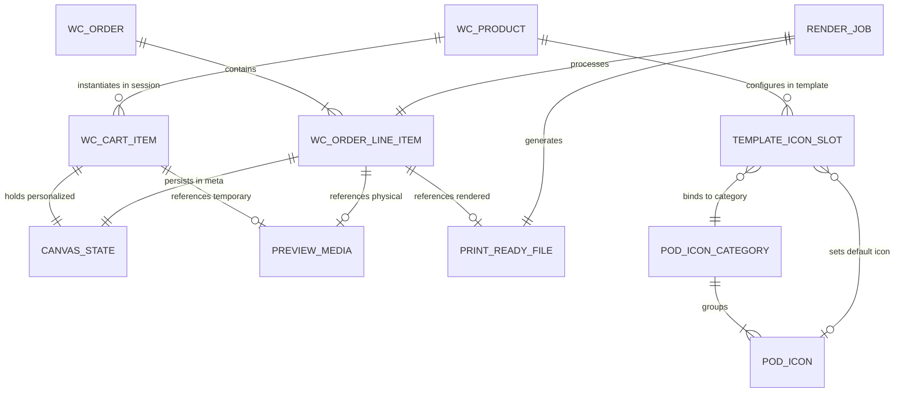

# Domain Entities Specification

---
title: "Domain Entities & Data Contracts"
updated_at: 2026-09-18T10:00:00Z
updated_by: Antigravity
status: APPROVED_FOR_DEVELOPMENT
version: 1.2
reference_database: "database.md"
---

Tài liệu này chuẩn hóa toàn bộ các thực thể nghiệp vụ (**Domain Entities**) và hợp đồng dữ liệu (**Data Contracts**) của hệ thống POD Personalization.

Mọi thành phần từ Client (Fabric.js), WordPress (`pod.localhost`) đến Backend Worker (`pod-backend.localhost`) đều phải tuân thủ nghiêm ngặt theo tài liệu này (Tuân thủ nguyên tắc **Strict Data Contracts & No Dummy Fallbacks** theo `.specify/constitution.md`). Chi tiết cấu trúc lưu trữ và câu lệnh DDL MySQL xem tại [**`database.md`**](database.md).

---

## 1. Bản Đồ Thực Thể (Domain Entity Model)

---

## 2. Chi Tiết Các Thực Thể Nghiệp Vụ (Entity Definitions)

### 2.1 Thực thể `CanvasState` (Client Design Contract)
Đại diện cho trạng thái thiết kế mà người dùng tùy biến trên trình duyệt.

| Thuộc tính | Kiểu dữ liệu | Bắt buộc | Mô tả |
| :--- | :--- | :--- | :--- |
| `canvas.width` | `int` | Có | Chiều rộng vùng vẽ logic (ví dụ: `600px` trên web, `2400px` lúc render). |
| `canvas.height` | `int` | Có | Chiều cao vùng vẽ logic (ví dụ: `600px` trên web, `2400px` lúc render). |
| `canvas.unit` | `string` | Có | Đơn vị kích thước (`px`). |
| `layers` | `CanvasLayer[]` | Có | Danh sách các layer cấu thành thiết kế. |

#### Thuộc tính của từng `CanvasLayer`:
- **`id`** (`string`, Bắt buộc): Mã định danh duy nhất của layer (ví dụ: `mockup_base`, `custom_text_1`, `clipart_1`, `slot_zodiac_icon`).
- **`type`** (`enum`: `'image' | 'text' | 'clipart'`, Bắt buộc): Phân loại layer.
- **`name`** (`string`, Bắt buộc): Tên hiển thị người dùng.
- **`x`**, **`y`** (`float`, Bắt buộc): Tọa độ góc trên bên trái của layer so với canvas.
- **`width`**, **`height`** (`float`, Bắt buộc): Kích thước hiển thị của layer.
- **`scaleX`**, **`scaleY`** (`float`, Bắt buộc): Tỉ lệ phóng to/thu nhỏ.
- **`rotation`** (`float`, Bắt buộc): Góc xoay (tính bằng độ, 0 - 360).
- **`printable`** (`boolean`, Bắt buộc): 
  - `false`: Layer mockup phôi áo/cốc (chỉ xem trên màn hình).
  - `true`: Layer thiết kế cần được ghép vào file in xuất xưởng 300 DPI.
- **Layer Text bổ sung**: `text` (`string`), `fontFamily` (`string`), `fontSize` (`float`), `fill` (`string`, mã HEX).
- **Layer Clipart / Image bổ sung**: `url` (`string`, URL công khai tuyệt đối), `svg` (`string`, tùy chọn nội dung SVG).

---

### 2.2 Thực thể `PodIconCategory` (Nhóm / Danh mục Biểu tượng)
Đại diện cho một nhóm biểu tượng dùng chung trong kho tài nguyên của hệ thống (ví dụ: Cung hoàng đạo, Thú cưng, Biểu tượng sinh nhật).

| Thuộc tính | Kiểu dữ liệu | Bắt buộc | Mô tả |
| :--- | :--- | :--- | :--- |
| `id` | `bigint` | Có | Khóa chính tự tăng của danh mục icon. |
| `name` | `string(255)` | Có | Tên hiển thị của nhóm (ví dụ: *"12 Cung Hoàng Đạo"*, *"Giống Chó Cưng"*). |
| `slug` | `string(100)` | Có | Định danh duy nhất dùng trong code/JSON (ví dụ: `zodiac_signs`, `pet_dogs`). |
| `description` | `text` | Không | Mô tả mục đích sử dụng cho Admin. |
| `sort_order` | `int` | Có | Thứ tự hiển thị ưu tiên trong bảng chọn Admin (mặc định: `0`). |
| `is_active` | `boolean` | Có | Trạng thái bật/tắt sử dụng (mặc định: `true`). |
| `created_at` | `timestamp` | Có | Thời điểm khởi tạo. |
| `updated_at` | `timestamp` | Có | Thời điểm cập nhật cấu hình lần cuối. |

---

### 2.3 Thực thể `PodIcon` (Biểu tượng / Clipart Cá nhân hóa)
Đại diện cho từng hình ảnh biểu tượng nằm trong một `PodIconCategory`. Mỗi icon có 2 phiên bản: ảnh hiển thị trên web và ảnh độ nét cao 300 DPI để in xưởng.

| Thuộc tính | Kiểu dữ liệu | Bắt buộc | Mô tả |
| :--- | :--- | :--- | :--- |
| `id` | `bigint` | Có | Khóa chính tự tăng của icon. |
| `category_id` | `bigint` | Có | Khóa ngoại tham chiếu đến `PodIconCategory.id`. |
| `title` | `string(255)` | Có | Tên biểu tượng hiển thị cho khách xem (ví dụ: *"Bạch Dương"*, *"Chó Corgi"*). |
| `slug` | `string(100)` | Có | Mã định danh icon trong danh mục (ví dụ: `aries`, `corgi_01`). |
| `thumbnail_url` | `string(500)` | Có | URL ảnh thu nhỏ nhẹ (SVG / PNG 72 DPI) hiển thị trên Swatches ngoài web. |
| `print_url` | `string(500)` | Có | URL ảnh gốc chất lượng cao chuẩn **300 DPI Transparent** phục vụ xưởng in. |
| `is_vector` | `boolean` | Có | Đánh dấu file định dạng SVG (`true`) hay Raster PNG (`false`). |
| `sort_order` | `int` | Có | Thứ tự hiển thị trong danh sách lựa chọn của khách (mặc định: `0`). |
| `status` | `enum` | Có | Trạng thái hiển thị (`'active' | 'inactive'`). |
| `created_at` | `timestamp` | Có | Thời điểm tải lên hệ thống. |

---

### 2.4 Thực thể `TemplateIconSlotBinding` (Vùng Giữ Chỗ Gắn Icon Trên Template)
Đại diện cho một vùng hình chữ nhật trên Canvas được Admin đánh dấu là **Vùng cho phép chèn Icon** và liên kết với một `PodIconCategory`.

| Thuộc tính | Kiểu dữ liệu | Bắt buộc | Mô tả |
| :--- | :--- | :--- | :--- |
| `slot_id` | `string(100)` | Có | ID của layer giữ chỗ trên template (ví dụ: `slot_zodiac_sign`). |
| `label` | `string(255)` | Có | Tiêu đề nhãn hiển thị phía trên Form (ví dụ: *"Chọn Cung Hoàng Đạo"*). |
| `is_icon_slot` | `boolean` | Có | Cờ đánh dấu vùng này cho phép nhận icon từ thư viện (luôn là `true`). |
| `category_id` | `bigint` | Có | ID của `PodIconCategory` được liên kết vào vùng này. |
| `category_slug`| `string(100)` | Có | Slug danh mục để serialize nhanh vào JSON (`zodiac_signs`). |
| `default_icon_id`| `bigint` | Không | Icon được chọn sẵn mặc định khi khách mới vào xem sản phẩm. |
| `ui_display_type`| `enum` | Có | Kiểu hiển thị trên Form (`'swatches'` - lưới icon bấm chọn, hoặc `'dropdown'`). |
| `bounds` | `object` | Có | Tọa độ & kích thước chuẩn xưởng: `{ x, y, width, height, rotation, z_index }`. |
| `allow_empty` | `boolean` | Có | Khách có được phép bỏ trống không chọn icon nào không (mặc định: `false`). |

---

### 2.5 Thực thể `PreviewMedia` (Mockup Tĩnh Phục Vụ Hiển Thị)
Đại diện cho ảnh chụp canvas (72 DPI) lưu trên ổ đĩa để phục vụ Mini-Cart, Cart Table, Email và Order Dashboard.

| Thuộc tính | Kiểu dữ liệu | Mô tả |
| :--- | :--- | :--- |
| `file_name` | `string` | Tên file vật lý (ví dụ: `preview_d9205ad2d29cc54a5b829bb728f2d3d4.jpg`). |
| `file_path` | `string` | Đường dẫn máy chủ: `wp-content/uploads/pod-previews/YYYY/MM/preview_*.jpg`. |
| `url` | `string` | URL tĩnh xem trực tiếp trên trình duyệt hoặc email client. |
| `mime_type` | `string` | MIME chuẩn (`image/jpeg`). |
| `created_at` | `timestamp`| Thời điểm tạo (dùng cho Cron Job tự động xóa sau 7 ngày retention). |

---

### 2.6 Thực thể `PrintReadyFile` (File In Xuất Xưởng 300 DPI)
Đại diện cho file in thành phẩm do Node.js Sharp Render Engine tạo ra.

| Thuộc tính | Kiểu dữ liệu | Mô tả |
| :--- | :--- | :--- |
| `file_name` | `string` | Tên file vật lý (ví dụ: `order_182_item_15_300dpi.png`). |
| `file_path` | `string` | Đường dẫn trên backend container: `/app/storage/prints/order_*_300dpi.png`. |
| `url` | `string` | URL công khai để Admin tải về (ví dụ: `http://pod-backend.localhost/prints/...`). |
| `width`, `height` | `int` | Kích thước pixel chuẩn in ấn (ví dụ: `2400 x 2400`). |
| `dpi` | `int` | Cố định `300`. |
| `format` | `string` | `png` (hỗ trợ Transparent Background cho máy in DTG). |
| `status` | `enum` | `'pending' | 'processing' | 'completed' | 'failed'`. |
