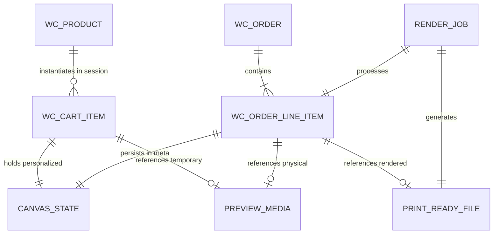
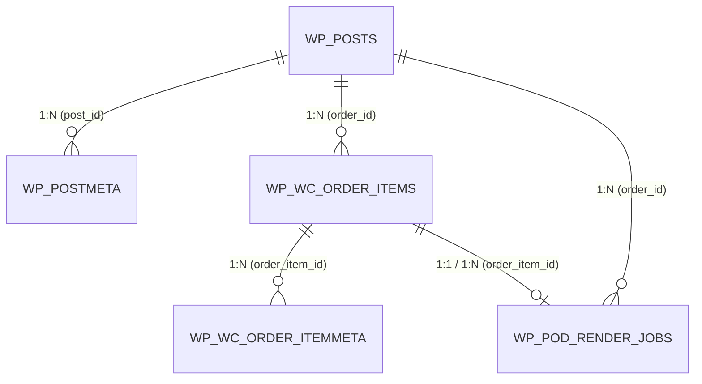

# Entities & Database Schema Specification

---
title: "Entities, Data Contracts & Database Storage"
updated_at: 2026-09-16T04:30:00Z
updated_by: Antigravity
status: APPROVED_FOR_DEVELOPMENT
version: 1.0
---

Tài liệu này chuẩn hóa toàn bộ các thực thể dữ liệu (**Domain Entities**), bảng biểu cơ sở dữ liệu (**Database Tables**), và hợp đồng dữ liệu (**Data Contracts**) của hệ thống POD Personalization.

Mọi thành phần từ Client (Fabric.js), WordPress (`pod.localhost`) đến Backend Worker (`pod-backend.localhost`) đều phải tuân thủ nghiêm ngặt theo tài liệu này (Tuân thủ nguyên tắc **Strict Data Contracts & No Dummy Fallbacks** theo `.specify/constitution.md`).

---

## 1. Bản Đồ Thực Thể (Domain Entity Model)



---

## 2. Chi Tiết Thực Thể (Entity Definitions)

### 2.1 Thực thể `CanvasState` (Client Design Contract)
Đại diện cho trạng thái thiết kế mà người dùng tùy biến trên trình duyệt.

| Thuộc tính | Kiểu dữ liệu | Bắt buộc | Mô tả |
| :--- | :--- | :--- | :--- |
| `canvas.width` | `int` | Có | Chiều rộng vùng vẽ logic (ví dụ: `600px`). |
| `canvas.height` | `int` | Có | Chiều cao vùng vẽ logic (ví dụ: `600px`). |
| `canvas.unit` | `string` | Có | Đơn vị kích thước (`px`). |
| `layers` | `CanvasLayer[]` | Có | Danh sách các layer cấu thành thiết kế. |

#### Thuộc tính của từng `CanvasLayer`:
- **`id`** (`string`, Bắt buộc): Mã định danh duy nhất của layer (ví dụ: `mockup_base`, `custom_text_1`, `clipart_1`, `user_photo_1`).
- **`type`** (`enum`: `'image' | 'text' | 'clipart'`, Bắt buộc): Phân loại layer.
- **`name`** (`string`, Bắt buộc): Tên hiển thị người dùng.
- **`x`**, **`y`** (`float`, Bắt buộc): Tọa độ góc trên bên trái của layer so với canvas.
- **`width`**, **`height`** (`float`, Bắt buộc): Kích thước hiển thị của layer.
- **`scaleX`**, **`scaleY`** (`float`, Bắt buộc): Tỉ lệ phóng to/thu nhỏ.
- **`rotation`** (`float`, Bắt buộc): Góc xoay (tính bằng độ, 0 - 360).
- **`printable`** (`boolean`, Bắt buộc): 
  - `false`: Layer mockup phôi áo/cốc (chỉ xem trên màn hình).
  - `true`: Layer thiết kế cần được ghép vào file in xuất xưởng 300 DPI.
- **Layer Text bổ sung**: `text` (`string`), `fontFamily` (`string`), `fontSize` (`float`), `fill` (`string`, mã HEX).
- **Layer Clipart / Image bổ sung**: `url` (`string`, URL công khai tuyệt đối), `svg` (`string`, tùy chọn nội dung SVG).

---

### 2.2 Thực thể `PreviewMedia` (Mockup Tĩnh Phục Vụ Hiển Thị)
Đại diện cho ảnh chụp canvas (72 DPI) lưu trên ổ đĩa để phục vụ Mini-Cart, Cart Table, Email và Order Dashboard.

| Thuộc tính | Kiểu dữ liệu | Mô tả |
| :--- | :--- | :--- |
| `file_name` | `string` | Tên file vật lý (ví dụ: `preview_d9205ad2d29cc54a5b829bb728f2d3d4.jpg`). |
| `file_path` | `string` | Đường dẫn máy chủ: `wp-content/uploads/pod-previews/YYYY/MM/preview_*.jpg`. |
| `url` | `string` | URL tĩnh xem trực tiếp trên trình duyệt hoặc email client. |
| `mime_type` | `string` | MIME chuẩn (`image/jpeg`). |
| `created_at` | `timestamp`| Thời điểm tạo (dùng cho Cron Job tự động xóa sau 7 ngày retention). |

---

### 2.3 Thực thể `PrintReadyFile` (File In Xuất Xưởng 300 DPI)
Đại diện cho file in thành phẩm do Node.js Sharp Render Engine tạo ra.

| Thuộc tính | Kiểu dữ liệu | Mô tả |
| :--- | :--- | :--- |
| `file_name` | `string` | Tên file vật lý (ví dụ: `order_182_item_15_300dpi.png`). |
| `file_path` | `string` | Đường dẫn trên backend container: `/app/storage/prints/order_*_300dpi.png`. |
| `url` | `string` | URL công khai để Admin tải về (ví dụ: `http://pod-backend.localhost/prints/...`). |
| `width`, `height` | `int` | Kích thước pixel chuẩn in ấn (ví dụ: `2400 x 3000` hoặc `3000 x 3000`). |
| `dpi` | `int` | Cố định `300`. |
| `format` | `string` | `png` (hỗ trợ Transparent Background cho máy in DTG). |
| `status` | `enum` | `'pending' | 'processing' | 'completed' | 'failed'`. |

---

## 3. Quy Định Bảng & Cấu Trúc Lưu Trữ Trong Database (MySQL 8.4)

### 3.1 Quy Tắc Đặt Tên Bảng (Table Naming & Prefix Convention)
- **Tiền tố bắt buộc (Mandatory Prefix)**: Mọi bảng custom do plugin tạo ra bắt buộc phải sử dụng tiền tố động của WordPress: `{$wpdb->prefix}pod_*` (Ví dụ với tiền tố mặc định `wp_`: bảng sẽ có tên là `wp_pod_render_jobs`, `wp_pod_preview_files`).
- **Tuyệt đối không hardcode tiền tố**: Trong code PHP, luôn gọi qua `$wpdb->prefix . 'pod_...'` để đảm bảo tương thích đa tiền tố hoặc môi trường WordPress Multisite (`wp_2_pod_...`).

---

### 3.2 Khóa Ngoại & Mối Quan Hệ Với Các Bảng Cốt Lõi (Foreign Keys & Relationships)

Hệ thống POD Personalization liên kết chặt chẽ với các bảng thực thể của WordPress Core và WooCommerce thông qua các khóa ngoại logic và vật lý:



#### Chi tiết ánh xạ Khóa ngoại:
1. **Khóa Ngoại `order_id`**:
   - **Tham chiếu đến**: `{$wpdb->prefix}posts.ID` (đối với WooCommerce legacy storage) hoặc `{$wpdb->prefix}wc_orders.id` (đối với High-Performance Order Storage - HPOS).
   - **Ràng buộc**: `ON DELETE CASCADE` (khi xóa đơn hàng, các job render và meta liên quan được dọn sạch).
2. **Khóa Ngoại `order_item_id`**:
   - **Tham chiếu đến**: `{$wpdb->prefix}woocommerce_order_items.order_item_id`.
   - **Ràng buộc**: `ON DELETE CASCADE` (khi một dòng sản phẩm bị xóa khỏi đơn, dữ liệu cá nhân hóa và job render tương ứng bị hủy).
3. **Khóa Ngoại `product_id`**:
   - **Tham chiếu đến**: `{$wpdb->prefix}posts.ID` (Sản phẩm WooCommerce).
   - **Ràng buộc**: `ON DELETE RESTRICT / SET NULL`.

---

### 3.3 Chi Tiết Lưu Trữ Tại Bảng Tiêu Chuẩn `{$wpdb->prefix}woocommerce_order_itemmeta`
Lưu trữ toàn bộ thông tin cá nhân hóa của từng dòng sản phẩm trong đơn hàng:

- **Khóa ngoại chính**: `order_item_id` tham chiếu trực tiếp đến `{$wpdb->prefix}woocommerce_order_items(order_item_id)`.

| `meta_key` | Kiểu lưu trữ | Mô tả nghiệp vụ |
| :--- | :--- | :--- |
| **`_pod_canvas_state`** | `longtext` (JSON) | Chuỗi JSON chứa toàn bộ trạng thái `CanvasState` (tọa độ layer, text, font, màu, clipart URL). |
| **`_pod_preview_url`** | `varchar(255)` | Đường dẫn URL file ảnh mockup preview (`http://.../uploads/pod-previews/2026/09/preview_*.jpg`). |
| **`_pod_print_ready_url`** | `varchar(255)` | Đường dẫn URL file in 300 DPI sau khi Backend render thành công (`http://.../prints/order_*_300dpi.png`). |
| **`_pod_print_status`** | `varchar(50)` | Trạng thái render: `pending`, `processing`, `completed`, `failed`. |
| **`_pod_render_error`** | `text` (tùy chọn) | Lưu lại thông báo lỗi nếu quá trình render bị thất bại để Admin kiểm tra. |

---

### 3.4 Bảng Cấu Hình Hệ Thống `{$wpdb->prefix}options`
Lưu trữ cấu hình toàn cục của plugin:

| `option_name` | Kiểu dữ liệu | Giá trị mẫu | Mô tả |
| :--- | :--- | :--- | :--- |
| **`pod_backend_url`** | `string` | `http://pod_backend:3001` | URL dịch vụ Node.js Backend để WordPress bắn Webhook render. |
| **`pod_shared_secret`** | `string` | `pod_dev_secret_key_2026` | Khóa bí mật dùng chung (X-POD-SECRET) xác thực giữa WP và Node.js. |
| **`pod_preview_retention_days`** | `int` | `7` | Số ngày lưu trữ preview trước khi WP-Cron tự động xóa dọn dẹp đĩa. |

---

### 3.5 Session Giỏ Hàng (`WC_Cart` Session Data)
Dữ liệu phiên duyệt web tạm thời trước khi checkout:

```php
$cart_item_data = [
    '_pod_canvas_state' => [ /* Decoded array of CanvasState */ ],
    '_pod_preview_url'  => 'http://pod.localhost/wp-content/uploads/pod-previews/2026/09/preview_xxx.jpg',
    'unique_key'        => 'md5_hash_distinguishing_item'
];
```

---

## 4. Bảng Tùy Biến Mở Rộng Khi Scale Lớn (Dedicated Queue & Jobs Table)

> [!NOTE]
> Bảng tùy biến này bắt buộc phải có tiền tố `{$wpdb->prefix}pod_` và ràng buộc toàn vẹn dữ liệu bằng **FOREIGN KEY** rõ ràng với các bảng WooCommerce.

```sql
CREATE TABLE IF NOT EXISTS `{$wpdb->prefix}pod_render_jobs` (
    `id` BIGINT UNSIGNED AUTO_INCREMENT PRIMARY KEY,
    `order_id` BIGINT UNSIGNED NOT NULL COMMENT 'Tham chiếu ID đơn hàng',
    `order_item_id` BIGINT UNSIGNED NOT NULL COMMENT 'Tham chiếu ID dòng sản phẩm WooCommerce',
    `status` ENUM('pending', 'processing', 'completed', 'failed') DEFAULT 'pending',
    `preview_url` VARCHAR(500) NULL,
    `print_ready_url` VARCHAR(500) NULL,
    `canvas_payload` LONGTEXT NOT NULL COMMENT 'Strict Canvas JSON Contract',
    `attempts` TINYINT UNSIGNED DEFAULT 0,
    `error_message` TEXT NULL,
    `created_at` DATETIME DEFAULT CURRENT_TIMESTAMP,
    `updated_at` DATETIME DEFAULT CURRENT_TIMESTAMP ON UPDATE CURRENT_TIMESTAMP,
    
    -- Chỉ mục tra cứu nhanh
    INDEX `idx_pod_status` (`status`),
    INDEX `idx_pod_order` (`order_id`),
    INDEX `idx_pod_order_item` (`order_item_id`),
    
    -- Định nghĩa Khóa Ngoại (Foreign Keys)
    CONSTRAINT `fk_pod_job_order_item`
        FOREIGN KEY (`order_item_id`) 
        REFERENCES `{$wpdb->prefix}woocommerce_order_items` (`order_item_id`)
        ON DELETE CASCADE
        ON UPDATE CASCADE
) ENGINE=InnoDB DEFAULT CHARSET=utf8mb4 COLLATE=utf8mb4_unicode_ci;
```

