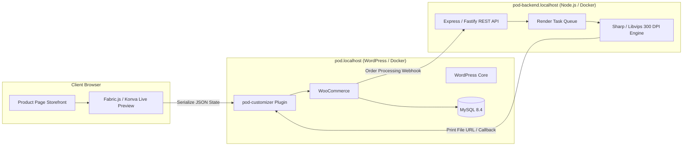

# Project Blueprint - POD Customizer & Render Engine

---
title: "Project Overview"
updated_at: 2026-09-16T00:00:00Z
updated_by: Antigravity
status: APPROVED_FOR_DEVELOPMENT
version: 1.0
---

## 1. Project Vision

Develop an end-to-end Print-on-Demand (POD) personalization solution for WooCommerce, mirroring the architecture and performance advantages of leading Shopify solutions (e.g., CustomMax).

The platform allows buyers to customize products in real time on the WooCommerce product page (text, fonts, clipart variants, uploaded photos, color choices) and automatically produces high-resolution 300 DPI print-ready production files when orders are placed, with zero server degradation on WordPress.

---

## 2. System Architecture Overview

> [!NOTE]
> - Chi tiết toàn bộ sơ đồ tuần tự (End-to-End Sequence Diagram) và quy trình làm việc của Admin trong Dashboard được đặc tả tại [**`.specify/workflows.md`**](./workflows.md).
> - Chuẩn hóa các Thực thể (Entities), Hợp đồng dữ liệu (Data Contracts), và Cấu trúc lưu trữ Database (Tables & Meta keys) được đặc tả tại [**`.specify/entities_and_database.md`**](./entities_and_database.md).

---

## 3. Sub-Domains & Local Development Environment

| Domain | Role | Tech Stack | Container Port |
| :--- | :--- | :--- | :--- |
| `pod.localhost` | E-commerce Storefront, Admin, Plugin | WordPress 6.x, PHP 8.2-FPM, Nginx, MySQL 8.4 | Port 80 (routed by Traefik) |
| `pod-backend.localhost` | Graphics Worker, Webhook API, Render Engine | Node.js 20 LTS, Sharp, Express/Fastify | Port 3001 (routed by Traefik) |

---

## 4. Key Milestones & Phases

* **Phase 1: Local Infrastructure Setup** ([`specs/001-local-environment-setup/`](../specs/001-local-environment-setup/))
  * Traefik integration on `proxy_network`.
  * Multi-container setup for `pod.localhost` and `pod-backend.localhost`.
  * Connectivity and routing healthchecks.
* **Phase 2: Core Plugin Boilerplate (`pod-customizer`)** ([`specs/002-plugin-architecture-boilerplate/`](../specs/002-plugin-architecture-boilerplate/))
  * PSR-4 structure adhering to SOLID/DRY.
  * WooCommerce hooks: Cart item custom data, Order item meta persistence, Admin order display.
  * Settings page with Backend Worker URL and secret token authentication.
* **Phase 3: Backend Render Worker Boilerplate** ([`specs/003-backend-render-engine/`](../specs/003-backend-render-engine/))
  * Node.js + Express with `sharp` installed.
  * Healthcheck endpoint (`/health`) and Render task endpoint (`/api/v1/render`).
  * Asynchronous queue scaffolding.
* **Phase 4: Storefront Personalization & Canvas Preview** ([`specs/004-storefront-canvas-customizer/`](../specs/004-storefront-canvas-customizer/))
  * Lightweight canvas integration on WooCommerce single product pages.
  * JSON state generator matching strict data contract.
* **Phase 5: Automated E2E Order-to-Print Flow** ([`specs/005-e2e-order-to-print-flow/`](../specs/005-e2e-order-to-print-flow/))
  * Webhook dispatch on order status change.
  * Sharp 300 DPI layer compositing.
  * Order meta update with high-resolution download link.
* **Phase 6: Custom Database Storage & Queue Pipeline** ([`specs/006-custom-database-tables/`](../specs/006-custom-database-tables/))
  * Dedicated tables `{$wpdb->prefix}pod_render_jobs` and `{$wpdb->prefix}pod_preview_files`.
  * Cascading foreign keys linked to WooCommerce `order_items`.
  * Safe `dbDelta` migration engine and Repository pattern.

