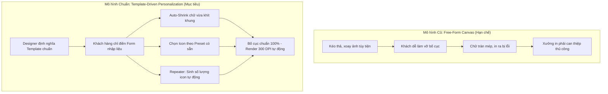
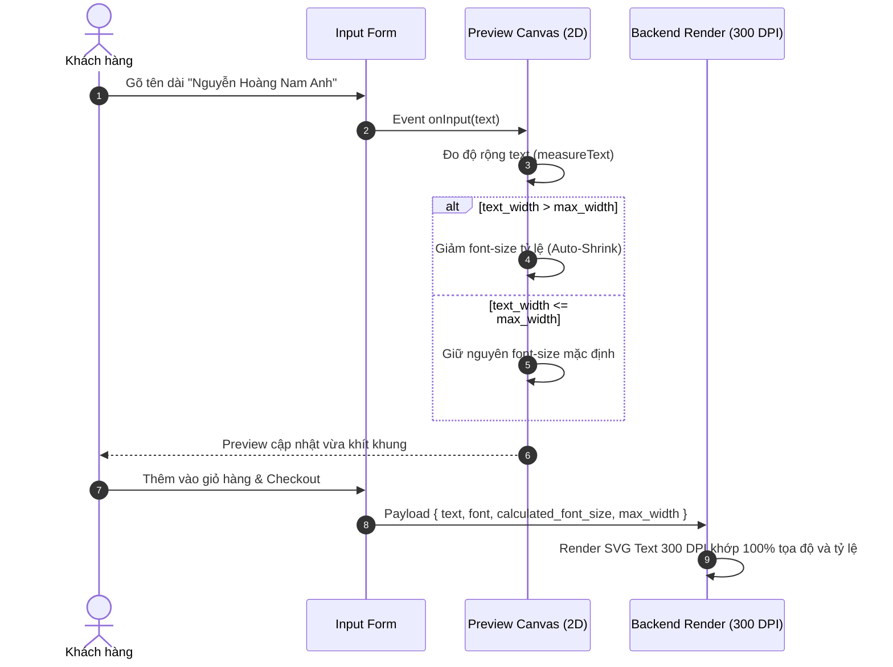

# Requirements & Use-Case Specification: Template-Driven Personalization

---
title: "Template-Driven Product Personalization Requirements"
created_at: 2026-09-17T11:00:00Z
author: "Antigravity & Product Owner"
status: "APPROVED_FOR_POC"
version: "1.0"
spec_ref: "008-admin-product-designer-config"
---

## 1. Bối cảnh & Bước chuyển định hướng (Paradigm Shift)

Qua phân tích thực tế sản phẩm POD thương mại, hệ thống **chuyển hướng dứt khoát** từ mô hình *"Canvas kéo thả tự do"* (Free-form editor) sang mô hình **"Cá nhân hóa theo Mẫu thiết kế chuẩn xưởng in" (Template-Driven Personalization)**:



---

## 2. Các nguyên tắc bất biến (Core Invariants)

1. **Khung hình chữ nhật 2D (Pure 2D Rectangular Area)**:
   - Toàn bộ thiết kế nằm trong một hoặc nhiều vùng in hình chữ nhật 2D cố định trên phôi sản phẩm (Áo, Cốc, Túi, Tranh canvas).
   - Chưa triển khai xem 3D ở giai đoạn này.
2. **Khóa ảnh nền Artwork (Fixed Background Art)**:
   - Khách hàng **không được phép** thay thế ảnh nền / background artwork chính của sản phẩm.
3. **Không kéo thả ảnh tự do (No Free-form Drag & Drop)**:
   - Loại bỏ tính năng kéo thả, phóng to, thu nhỏ tùy tiện của khách hàng đối với các đối tượng hình ảnh/icon.
4. **Form-Driven UI**:
   - Khách hàng tương tác qua **form nhập liệu trực quan** (nhập text, chọn số lượng, bấm chọn icon có sẵn). Màn hình canvas 2D đóng vai trò **Preview tự động cập nhật thời gian thực (Live WYSIWYG)**.
5. **Chiến lược triển khai: POC Storefront & Backend trước**:
   - Xây dựng bản thử nghiệm tương tác (POC) trên Storefront và kết nối Render Backend 300 DPI trước để kiểm chứng thực tế và hoàn thiện JSON Schema.
   - Giao diện quản trị WP-Admin sẽ được xây dựng sau khi Schema đã được chuẩn hóa và đóng băng.

---

## 3. Danh mục các trường hợp nghiệp vụ chi tiết (Use-Case Registry)

### Trường hợp 1: Text cố định vị trí kèm cơ chế Tự động co chữ (Auto-Shrink Text Fitting)
* **Mô tả nghiệp vụ**:
  - Template có một hoặc nhiều vị trí Text cố định (ví dụ: `Tên người nhận`, `Năm sinh`, `Lời nhắn gửi`).
  - Mỗi vị trí Text được Designer chỉ định: tọa độ `(x, y)`, font chữ, màu sắc, kiểu căn lề (`left`, `center`, `right`), và **chiều rộng tối đa cho phép** (`max_width`).
* **Cơ chế Auto-Shrink**:
  - Khi khách hàng nhập chuỗi ngắn (vd: `"AN"`): Chữ giữ nguyên kích thước font ban đầu (`fontSize: 48px`).
  - Khi khách hàng nhập chuỗi dài (vd: `"NGUYỄN HOÀNG THÁI BẢO"`): Nếu tổng chiều rộng thực tế của chuỗi vượt quá `max_width`, hệ thống **tự động tính toán tỷ lệ co và giảm kích thước font** (`fontSize = initialFontSize * (max_width / text_width)`) cho đến khi vừa vặn trong khung, không bao giờ tràn ra ngoài viền hoặc đè lên các họa tiết khác.
  - Có giới hạn kích thước tối thiểu (`min_font_size`) để chữ không bị nhỏ đến mức không đọc được.



---

### Trường hợp 2: Icon / Sub-Image theo bộ lựa chọn có sẵn (Curated Presets - Không Upload bừa bãi)
* **Mô tả nghiệp vụ**:
  - Một số sản phẩm cho phép cá nhân hóa biểu tượng (ví dụ: chọn cung hoàng đạo, biểu tượng vương miện, kiểu tóc, giống thú cưng Corgi / Poodle / Mèo Anh...).
* **Quy tắc**:
  - Khách hàng **không được upload file ảnh tùy tiện** từ máy tính.
  - Hệ thống cung cấp danh sách lựa chọn định sẵn (Preset Options) dưới dạng nút chọn hình thu nhỏ (Image Swatches), Radio card, hoặc Dropdown.
  - Khi khách chọn một option, icon tại vị trí chỉ định trên canvas lập tức chuyển đổi sang mẫu tương ứng.

---

### Trường hợp 3: Dynamic Quantity Repeater (Sinh số lượng sub-image theo số nhập vào)
* **Mô tả nghiệp vụ**:
  - Sản phẩm cho phép người dùng nhập một con số cụ thể, và hệ thống tự động sinh ra đúng số lượng hình ảnh tương ứng.
  - **Ví dụ thực tế**:
    - Nhập số tuổi `10` ➔ Tự động vẽ **10 cây nến** xếp đều trên chiếc bánh sinh nhật.
    - Nhập số năm kỷ niệm `5` ➔ Tự động vẽ **5 trái tim** hoặc ngôi sao.
    - Nhập số con / thú cưng `3` ➔ Tự động hiển thị **3 dấu chân thú** hoặc 3 nhân vật nhỏ.
* **Quy tắc xếp đặt (Layout Distribution Rules)**:
  - Cho phép cấu hình:
    - `horizontal_distribute`: Căn đều theo chiều ngang trong một khung tọa độ `[x1, x2]`. Nếu số lượng ít thì dãn cách đều; nếu số lượng nhiều thì tự động co khoảng cách `gap` lại để không vượt khung.
    - `arc_distribute` (mở rộng): Xếp theo đường cong hoặc cung tròn.
  - Giới hạn số lượng nhập (`min: 1`, `max: 30`) để tránh tràn bố cục.

---

### Trường hợp 4: Sản phẩm đa mặt in / kiểu dáng (Multi-Style & Multi-View)
* **Mô tả nghiệp vụ**:
  - Sản phẩm có thể có nhiều mặt in (Mặt trước - Front, Mặt sau - Back).
  - Khách hàng có thể chuyển đổi giữa các mặt để điền thông tin tương ứng cho từng mặt.
  - Khi checkout, đơn hàng đóng gói đầy đủ payload của tất cả các mặt in đã tùy biến để xưởng in xuất đủ file.

---

## 4. Đặc tả Hợp đồng dữ liệu mẫu (POC Data Contracts)

### 4.1 Cấu hình Mẫu Template của Sản phẩm (`template_config.json`)

```json
{
  "template_id": "tpl_birthday_mug_01",
  "product_title": "Personalized Birthday Candle Mug",
  "print_spec": {
    "width_px": 2400,
    "height_px": 1050,
    "dpi": 300
  },
  "mockup": {
    "url": "/wp-content/plugins/pod-customizer/assets/mockups/mug-white.svg",
    "bounds": { "x": 300, "y": 200, "width": 1800, "height": 700 }
  },
  "fields": [
    {
      "id": "recipient_name",
      "type": "text",
      "label": "Tên người nhận",
      "placeholder": "Ví dụ: Nam Anh",
      "default_value": "Alex",
      "position": { "x": 1200, "y": 420 },
      "style": {
        "font_family": "Montserrat",
        "font_weight": "700",
        "font_size_px": 64,
        "min_font_size_px": 24,
        "color": "#1e293b",
        "align": "center",
        "max_width_px": 700
      }
    },
    {
      "id": "custom_message",
      "type": "text",
      "label": "Lời chúc mừng",
      "placeholder": "Ví dụ: Chúc mừng sinh nhật!",
      "default_value": "Happy Birthday!",
      "position": { "x": 1200, "y": 500 },
      "style": {
        "font_family": "Dancing Script",
        "font_weight": "600",
        "font_size_px": 44,
        "min_font_size_px": 20,
        "color": "#e11d48",
        "align": "center",
        "max_width_px": 600
      }
    },
    {
      "id": "candle_count",
      "type": "repeater_counter",
      "label": "Số tuổi (Số lượng cây nến)",
      "default_value": 5,
      "min": 1,
      "max": 18,
      "sub_image": {
        "url": "/wp-content/plugins/pod-customizer/assets/cliparts/candle.svg",
        "width_px": 36,
        "height_px": 72
      },
      "container_bounds": {
        "x": 850,
        "y": 320,
        "width_px": 700,
        "height_px": 80,
        "distribution": "horizontal_center_gap"
      }
    },
    {
      "id": "badge_icon",
      "type": "preset_picker",
      "label": "Biểu tượng yêu thích",
      "default_value": "crown",
      "position": { "x": 1200, "y": 240, "width_px": 60, "height_px": 60 },
      "options": [
        { "id": "crown", "label": "Vương miện", "url": "/wp-content/plugins/pod-customizer/assets/cliparts/crown.svg" },
        { "id": "star", "label": "Ngôi sao", "url": "/wp-content/plugins/pod-customizer/assets/cliparts/star.svg" },
        { "id": "heart", "label": "Trái tim", "url": "/wp-content/plugins/pod-customizer/assets/cliparts/heart.svg" },
        { "id": "paw", "label": "Dấu chân thú", "url": "/wp-content/plugins/pod-customizer/assets/cliparts/paw.svg" }
      ]
    }
  ]
}
```

### 4.2 Dữ liệu khách hàng lựa chọn (`personalization_state.json`)

```json
{
  "template_id": "tpl_birthday_mug_01",
  "values": {
    "recipient_name": "Nguyễn Hoàng Nam Anh",
    "custom_message": "Happy 10th Birthday!",
    "candle_count": 10,
    "badge_icon": "crown"
  },
  "calculated_metrics": {
    "recipient_name": {
      "effective_font_size": 38.5,
      "is_shrunk": true
    }
  }
}
```

---

## 5. Lộ trình thực hiện (Proof of Concept Roadmap)

1. **Bước 1: Storefront Form-Driven UI (Frontend)**:
   - Xây dựng form nhập liệu trực tiếp cạnh sản phẩm (các ô Text, ô chọn Số lượng nến, cụm nút bấm chọn Icon).
   - Canvas Fabric.js đóng vai trò màn hình Preview hiển thị kết quả trực tiếp.
   - Viết thuật toán **Auto-Shrink** cho text và thuật toán **Horizontal Center Distribution** cho Repeater.
2. **Bước 2: Backend Sharp 300 DPI Compositor**:
   - Cập nhật backend Node.js để nhận template payload và áp dụng chính xác thuật toán Auto-Shrink (SVG text với kích thước font co giãn tương ứng) và xếp dàn cây nến thành phẩm 300 DPI.
3. **Bước 3: Đánh giá & Khóa Schema**:
   - Chạy thử nghiệm E2E, kiểm tra độ sắc nét và sự đồng bộ 100% giữa màn hình khách hàng và file in.
4. **Bước 4: Xây dựng giao diện WP-Admin**:
   - Đóng gói giao diện cấu hình trong trang Quản trị WordPress dựa trên Schema đã được thử nghiệm thành công.
