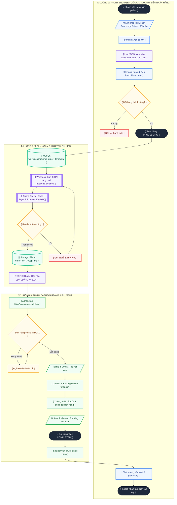
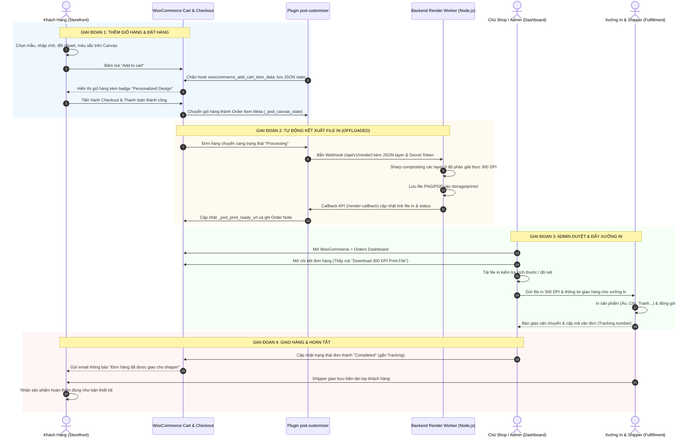

# Workflow Specifications: E-Commerce Storefront & Admin Fulfillment

---
title: "Workflows & Lifecycle Diagrams"
updated_at: 2026-09-16T00:00:00Z
updated_by: Antigravity
version: 1.1
status: APPROVED_FOR_DEVELOPMENT
---

Tài liệu này đặc tả trực quan các quy trình cốt lõi của hệ thống POD Personalization bằng sơ đồ hình khối tiêu chuẩn:
1. **Sơ đồ hình khối tổng thể (Multi-Shape Flowchart)**: Thể hiện hành trình từ lúc User nhấn "Add to Cart", hệ thống ngầm render 300 DPI, đến Admin xử lý trong Dashboard và hoàn tất đơn hàng.
2. **Sơ đồ tương tác tuần tự (Sequence Diagram)**: Chi tiết thông điệp API và webhook giữa các tầng hệ thống.
3. **Đặc tả nghiệp vụ chi tiết 4 giai đoạn**.

---

## 1. Sơ Đồ Quy Trình Tổng Thể Đa Khối Hình (Comprehensive Flowchart)

> **Quy ước hình khối:**  
> - **Hình Tròn / Bầu dục `(( ... ))` / `([ ... ])`**: Điểm Bắt đầu, Kết thúc hoặc Trạng thái đơn hàng (Milestones / Status).  
> - **Hình Chữ nhật `[ ... ]`**: Hành động hoặc bước xử lý nghiệp vụ (Process).  
> - **Hình Thoi / Tam giác rẽ nhánh `{ ... }`**: Điểm quyết định logic / Rẽ nhánh điều kiện (Decision).  
> - **Hình Bình hành `[/ ... /]`**: Nhập dữ liệu đầu vào hoặc Xuất kết quả (Input / Output).  
> - **Hình Trụ `[( ... )]`**: Cơ sở dữ liệu và Kho lưu trữ file (Database / Storage).  
> - **Hình Hộp kép `[[ ... ]]`**: Tiến trình hệ thống xử lý ngầm (Subprocess).

---

## 2. Toàn Bộ Vòng Đời Đơn Hàng (Sequence Diagram)

---

## 3. Đặc Tả Chi Tiết Từng Giai Đoạn

### Giai đoạn 1: Storefront Customization & Add to Cart
- **Người thực hiện**: Khách hàng (End-user).
- **Hành vi**: Khách mở trang sản phẩm POD, thao tác trên Live Preview Canvas nhẹ (72 DPI).
- **Sự kiện cốt lõi**:
  1. Khách bấm *"Add to cart"*, Canvas export toàn bộ cấu hình thành chuỗi JSON (`pod_canvas_state`).
  2. Plugin WordPress đón filter `woocommerce_add_cart_item_data`, kiểm tra tính hợp lệ của JSON và lưu vào session giỏ hàng.
  3. Giỏ hàng và trang thanh toán hiển thị badge nhận diện sản phẩm cá nhân hóa.

### Giai đoạn 2: Tự Động Render File In Độ Phân Giải Cao (Offloaded 300 DPI)
- **Người thực hiện**: Hệ thống tự động (Plugin + Backend Worker).
- **Hành vi**:
  1. Khi đơn hàng chuyển sang trạng thái `processing`, `OrderWebhookDispatcher` gửi request POST sang `http://pod-backend.localhost/api/v1/render`.
  2. Backend Worker xác thực token `X-POD-SECRET`, đẩy vào queue xử lý.
  3. Thư viện `sharp` tạo canvas mật độ in 300 DPI (`density: 300`), ghép lần lượt các layer ảnh gốc chất lượng cao và xuất file PNG/PDF vào `storage/prints/`.
  4. Backend Worker gọi ngược REST API `/wp-json/pod-customizer/v1/render-callback` để lưu URL file in vào Order Item Meta (`_pod_print_ready_url`) và cập nhật status `completed`.

### Giai đoạn 3: Admin Phê Duyệt & Xuất Xưởng (Admin Dashboard)
- **Người thực hiện**: Chủ shop / Quản lý đơn hàng (Admin).
- **Hành vi**:
  1. Admin truy cập `WooCommerce > Orders`, mở chi tiết đơn hàng.
  2. Bên dưới tên sản phẩm có hiển thị hộp thông tin kèm nút: **"Download 300 DPI Print File"**.
  3. Admin tải file về kiểm tra hoặc hệ thống tự động đẩy file qua API xưởng in (CustomCat, Printful, Dreamship).
  4. Xưởng in tiến hành sản xuất sản phẩm thực tế theo file in 300 DPI.

### Giai đoạn 4: Giao Hàng & Hoàn Tất Đơn
- **Người thực hiện**: Đơn vị vận chuyển + Khách hàng.
- **Hành vi**:
  1. Xưởng in bàn giao kiện hàng cho đơn vị vận chuyển, cập nhật mã vận đơn (Tracking number).
  2. Admin chuyển trạng thái đơn hàng sang `Completed`.
  3. Khách nhận email thông báo kèm mã vận đơn và nhận hàng hoàn thiện tận tay.
