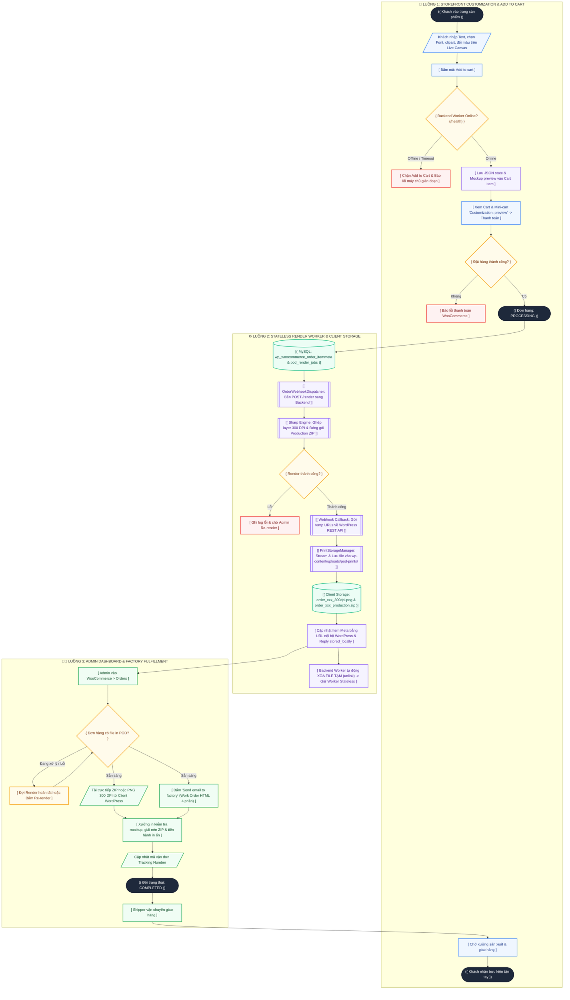
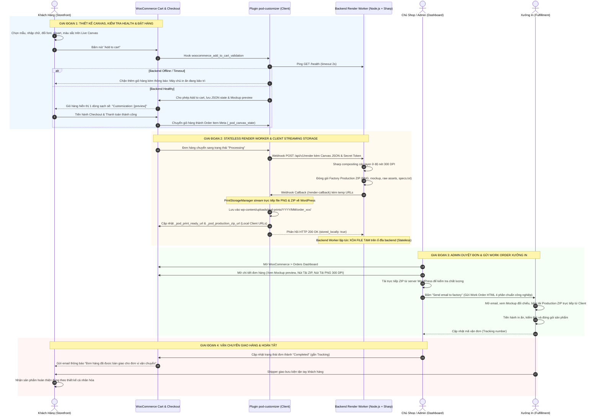

# Workflow Specifications: E-Commerce Storefront & Admin Fulfillment

---
title: "Workflows & Lifecycle Diagrams"
updated_at: 2026-09-16T15:15:00Z
updated_by: Antigravity
version: 2.0
status: APPROVED_FOR_DEVELOPMENT
---

Tài liệu này đặc tả trực quan các quy trình cốt lõi của hệ thống POD Personalization bằng sơ đồ hình khối tiêu chuẩn:
1. **Sơ đồ hình khối tổng thể (Multi-Shape Flowchart)**: Thể hiện hành trình từ lúc User thiết kế trên Canvas, kiểm tra Backend Health khi Add to Cart, hệ thống ngầm render 300 DPI & đóng gói ZIP, kéo file về lưu trữ nội bộ tại WordPress Client, giải phóng worker tạm thời, đến Admin xử lý trong Dashboard và hoàn tất đơn hàng.
2. **Sơ đồ tương tác tuần tự (Sequence Diagram)**: Chi tiết thông điệp API, webhook, cơ chế stream lưu file client-side và dọn dẹp worker phi trạng thái.
3. **Đặc tả nghiệp vụ chi tiết 4 giai đoạn**.

---

## 1. Sơ Đồ Quy Trình Tổng Thể Đa Khối Hình (Comprehensive Flowchart)

> **Quy ước hình khối:**  
> - **Hình Tròn / Bầu dục `(( ... ))` / `([ ... ])`**: Điểm Bắt đầu, Kết thúc hoặc Trạng thái đơn hàng (Milestones / Status).  
> - **Hình Chữ nhật `[ ... ]`**: Hành động hoặc bước xử lý nghiệp vụ (Process).  
> - **Hình Thoi / Tam giác rẽ nhánh `{ ... }`**: Điểm quyết định logic / Rẽ nhánh điều kiện (Decision).  
> - **Hình Bình hành `[/ ... /]`**: Nhập dữ liệu đầu vào hoặc Xuất kết quả (Input / Output).  
> - **Hình Trụ `[( ... )]`**: Cơ sở dữ liệu và Kho lưu trữ file (Database / Storage).  
> - **Hình Hộp kép `[[ ... ]]`**: Tiến trình hệ thống xử lý ngầm (Subprocess).

---

## 2. Toàn Bộ Vòng Đời Đơn Hàng (Sequence Diagram)

---

## 3. Đặc Tả Chi Tiết Từng Giai Đoạn

### Giai đoạn 1: Storefront Customization, Health Check & Add to Cart
- **Người thực hiện**: Khách hàng (End-user).
- **Hành vi**: Khách mở trang sản phẩm POD, thao tác thiết kế trên Live Preview Canvas.
- **Sự kiện cốt lõi**:
  1. Khách bấm *"Add to cart"*, Canvas export toàn bộ cấu hình thành chuỗi JSON (`pod_canvas_state`) kèm ảnh preview mockup JPEG nhẹ.
  2. Filter `woocommerce_add_to_cart_validation` kích hoạt:
     - Gửi ping nhanh (`timeout: 2s`) tới endpoint `{$backend_url}/health`.
     - Nếu máy chủ render offline hoặc mất kết nối: Hệ thống chặn thêm giỏ hàng và hiển thị thông báo lỗi thân thiện: *"Dịch vụ tùy biến in ấn tạm thời gián đoạn. Vui lòng thử lại sau ít phút."*
     - Nếu kết nối bình thường: Cho phép thêm vào giỏ hàng.
  3. Giỏ hàng và Mini-cart Flatsome hiển thị 1 dòng văn bản duy nhất: `Customization: [preview]` (link mở ảnh preview trong tab mới, không dùng thẻ `` tránh vỡ layout).
  4. Hệ thống tự động xóa cache `sessionStorage` cart fragments khi tải trang để đảm bảo dữ liệu luôn mới nhất.

---

### Giai đoạn 2: Stateless Render Worker & Client-Side File Storage
- **Người thực hiện**: Hệ thống tự động (Plugin + Backend Worker).
- **Hành vi**:
  1. Khi đơn hàng chuyển sang trạng thái `processing`, `OrderWebhookDispatcher` gửi request POST sang Backend Worker (`/api/v1/render`) kèm chữ ký `X-POD-SECRET`.
  2. Backend Worker (Node.js + Sharp) xử lý:
     - Ghép các layer ảnh chất lượng cao và text vector SVG ở mật độ 300 DPI (`density: 300`).
     - Đóng gói file ZIP hoàn chỉnh gồm: `01_print_ready_300dpi.png`, `02_mockup_preview.jpg`, `03_raw_assets/`, `04_production_specs.txt`.
  3. Backend Worker gọi Webhook Callback sang WordPress (`/wp-json/pod-customizer/v1/render-callback`) gửi kèm đường dẫn tạm thời.
  4. Phía WordPress (`PrintStorageManager`):
     - Sử dụng `wp_remote_get()` dạng stream trực tiếp để tải file PNG 300 DPI và file ZIP về lưu cố định tại:  
       `wp-content/uploads/pod-prints/{year}/{month}/order_{order_id}/`.
     - Cập nhật Order Item Meta bằng **chính URL công khai của WordPress client**:  
       `_pod_print_ready_url` & `_pod_production_zip_url`.
     - Trả về phản hồi `HTTP 200 OK` với cờ `stored_locally: true`.
  5. Phía Backend Worker:
     - Khi nhận được xác nhận `stored_locally: true`, worker lập tức gọi `fs.unlink()` để **xóa sạch file tạm** trên ổ đĩa backend.
     - Backend duy trì trạng thái hoàn toàn **stateless**, không tiêu tốn dung lượng lưu trữ dài hạn.

---

### Giai đoạn 3: Admin Dashboard & Factory Work Order Dispatch
- **Người thực hiện**: Quản trị viên (Admin) & Xưởng in (Factory).
- **Hành vi**:
  1. Menu Cài đặt tập trung tại: **WP Admin > Cài đặt (Settings) > POD Customizer** (`options-general.php?page=pod-customizer-settings`).
  2. Admin truy cập chi tiết đơn hàng tại `WooCommerce > Orders`:
     - Bên dưới sản phẩm tùy biến hiển thị hộp thông tin: ảnh preview hoàn thiện, nút **`[📦 Tải gói sản xuất (ZIP)]`**, nút **`[⬇️ Tải file in 300 DPI]`** và nút **`[🔄 Re-render Item]`**.
     - Cả 2 nút tải file đều trỏ trực tiếp về máy chủ WordPress client.
  3. Gửi thông tin xưởng in:
     - Nhập email xưởng (hoặc dùng email mặc định từ Settings) và bấm **`[✉️ Gửi email cho xưởng in]`**.
     - Hệ thống gửi email HTML Work Order chuyên nghiệp gồm 4 phần:
       1. Bảng thông số đơn hàng & quy cách in ấn (SKU phôi, kích cỡ, màu sắc, số lượng, chuẩn 300 DPI PNG).
       2. Nút bấm nổi bật tải Complete Production ZIP Package và Standalone 300 DPI PNG kèm đường dẫn URL thô.
       3. Ảnh Mockup hoàn thiện trực quan để thợ in đối chiếu vị trí/tỉ lệ.
       4. Thông tin giao nhận (Tên khách hàng, số điện thoại, địa chỉ nhận hàng, ghi chú của khách).
     - Tự động ghi Order Note trong lịch sử đơn hàng.

---

### Giai đoạn 4: Giao Hàng & Hoàn Tất Đơn
- **Người thực hiện**: Xưởng in + Đơn vị vận chuyển + Khách hàng.
- **Hành vi**:
  1. Xưởng in giải nén file ZIP, tiến hành in ấn bằng máy in chuyên dụng (DTG/Sublimation), kiểm định chất lượng đối chiếu với ảnh mockup.
  2. Bàn giao kiện hàng cho đơn vị vận chuyển và cấp mã vận đơn (Tracking number).
  3. Admin cập nhật mã vận đơn và chuyển trạng thái đơn hàng thành `Completed`.
  4. Khách nhận email thông báo tiến độ giao hàng và nhận bưu kiện hoàn thiện tận tay.
