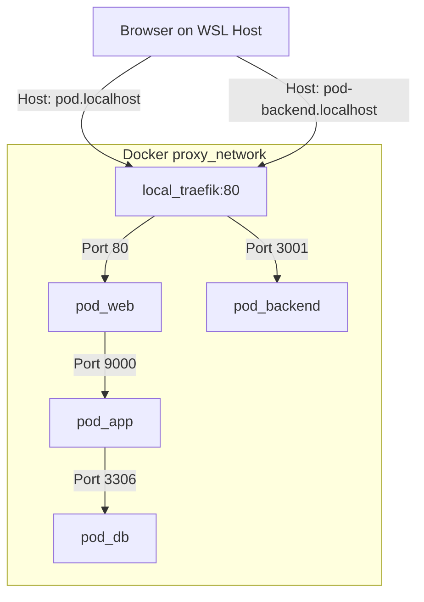

# Implementation Plan: Local Development Infrastructure & Traefik Setup

**Feature Key**: `001-local-environment-setup`  
**Related Spec**: [`./spec.md`](./spec.md)  
**Status**: `IMPLEMENTED`  

---

## 1. Technical Stack & Network Topology



---

## 2. Directory Layout

```text
/home/quyle91/projects/pod/
├── .specify/                          <--- Authoritative System Requirements
│   ├── constitution.md
│   ├── project.md
│   ├── execution_rules.md
│   └── research/
├── specs/                             <--- Feature Specifications & Execution Trackers
│   └── 001-local-environment-setup/
│       ├── spec.md
│       ├── plan.md
│       └── tasks.md
├── pod.localhost/                     <--- WordPress Site
│   ├── .env & .env.example
│   ├── Dockerfile
│   ├── docker-compose.yml
│   ├── docker-compose.override.yml
│   ├── docker/
│   │   ├── nginx/default.conf
│   │   └── php/ (www.conf, zzz-uploads.ini)
│   └── source/
│       └── wp-content/plugins/pod-customizer/
└── pod-backend.localhost/             <--- Node.js Render Worker
    ├── .env & .env.example
    ├── Dockerfile
    ├── docker-compose.yml
    ├── package.json
    └── src/
        ├── server.js
        ├── routes/
        ├── services/
        └── middleware/
```

---

## 3. Container Resource & Configuration Rules

1. **Traefik Network**: Both stacks join `proxy_network` with `external: true`.
2. **Persistent Volumes**: MySQL database persists in `pod_db_data`. Backend render output saves to `/app/storage/prints`.
3. **Execution Protocol**: Docker commands run in background mode (`-d`), file permissions match host user `1000:1000`.
