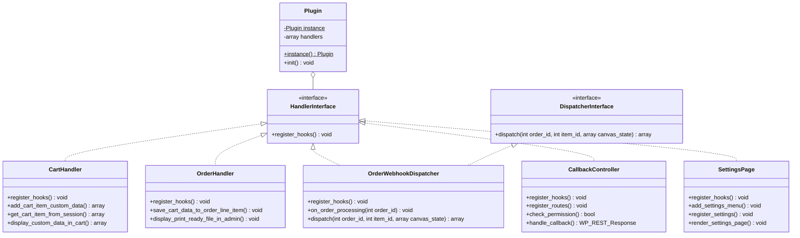

# Implementation Plan: WordPress Plugin Architecture Boilerplate (`pod-customizer`)

**Feature Key**: `002-plugin-architecture-boilerplate`  
**Related Spec**: [`./spec.md`](./spec.md)  
**Status**: `IMPLEMENTED`  

---

## 1. Class Diagram & Architecture Design



---

## 2. Directory Structure of Plugin

```text
source/wp-content/plugins/pod-customizer/
├── pod-customizer.php                  <--- Bootstrap & autoloader fallback
├── composer.json                       <--- PSR-4 namespace mapping
└── src/
    ├── Contracts/
    │   ├── HandlerInterface.php
    │   └── DispatcherInterface.php
    ├── Core/
    │   └── Plugin.php
    ├── WooCommerce/
    │   ├── CartHandler.php
    │   ├── OrderHandler.php
    │   └── OrderWebhookDispatcher.php
    ├── Admin/
    │   └── SettingsPage.php
    └── API/
        └── CallbackController.php
```
