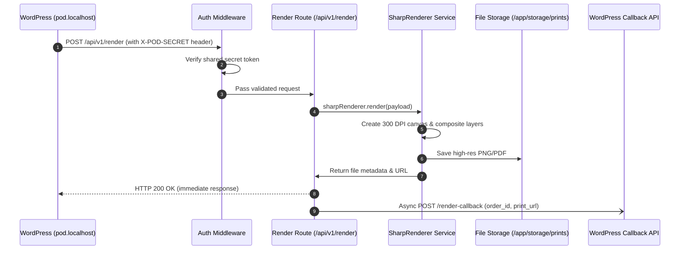

# Implementation Plan: Node.js 300 DPI Graphics Render Engine

**Feature Key**: `003-backend-render-engine`  
**Related Spec**: [`./spec.md`](./spec.md)  
**Status**: `IMPLEMENTED`  

---

## 1. Sequence & Data Flow Diagram



---

## 2. Directory Layout of Backend

```text
pod-backend.localhost/
├── .env & .env.example
├── Dockerfile
├── docker-compose.yml
├── package.json
├── storage/
│   └── prints/                        <--- Rendered output files
└── src/
    ├── server.js                      <--- Express setup & middlewares
    ├── middleware/
    │   └── auth.js                    <--- Secret token verification
    ├── routes/
    │   └── render.js                  <--- /api/v1/render endpoint
    └── services/
        └── sharpRenderer.js           <--- Sharp 300 DPI compositing
```
