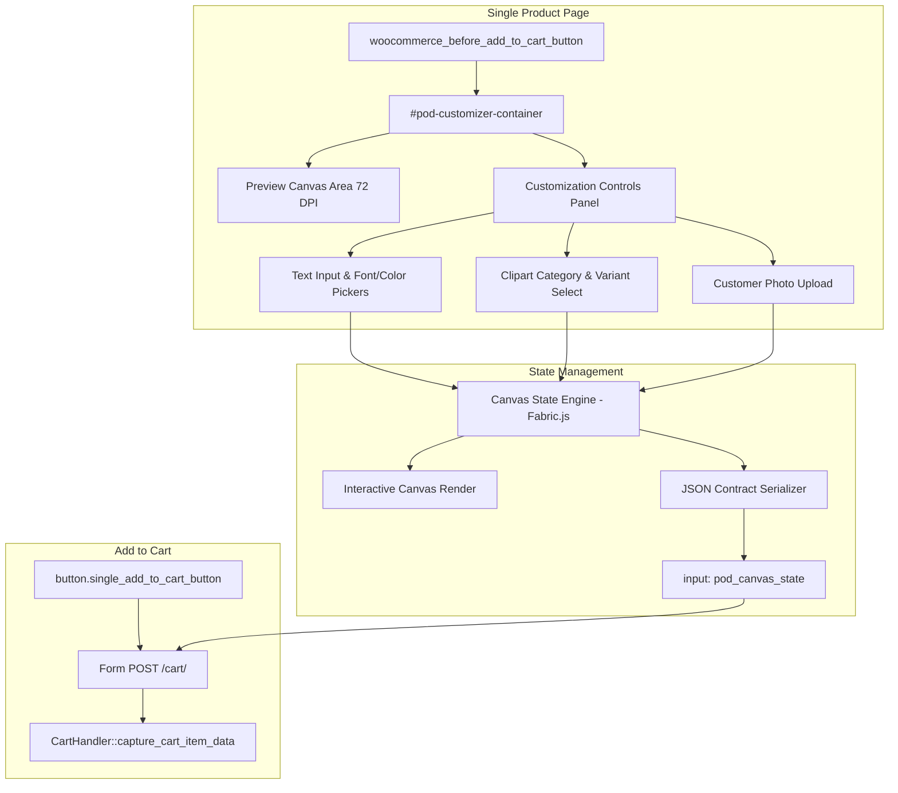

# Technical Plan: Storefront Personalization & Canvas Live Preview

**Feature Key**: `004-storefront-canvas-customizer`  
**Related Spec**: [`./spec.md`](./spec.md)  
**Status**: `READY_FOR_REVIEW`  

---

## 1. Technical Architecture & Component Flow



---

## 2. Strict Canvas State Data Contract Schema

Per `.specify/constitution.md`, the payload serialized into `pod_canvas_state` must strictly conform to:

```json
{
  "version": "1.0",
  "canvas": {
    "width": 1200,
    "height": 1200,
    "dpi": 300,
    "unit": "px"
  },
  "preview": {
    "width": 600,
    "height": 600
  },
  "layers": [
    {
      "id": "mockup_base",
      "type": "image",
      "name": "Product Base",
      "url": "http://pod.localhost/wp-content/plugins/pod-customizer/assets/mockups/tshirt-white.png",
      "x": 0,
      "y": 0,
      "width": 1200,
      "height": 1200,
      "zIndex": 1,
      "printable": false
    },
    {
      "id": "clipart_1",
      "type": "image",
      "name": "Selected Clipart",
      "url": "http://pod.localhost/wp-content/plugins/pod-customizer/assets/cliparts/cat-01.png",
      "x": 450,
      "y": 350,
      "width": 300,
      "height": 300,
      "rotation": 0,
      "zIndex": 2,
      "printable": true
    },
    {
      "id": "custom_text_1",
      "type": "text",
      "name": "Custom Title",
      "text": "Happy Birthday Dad!",
      "fontFamily": "Roboto",
      "fontSize": 48,
      "fill": "#111827",
      "textAlign": "center",
      "x": 600,
      "y": 700,
      "zIndex": 3,
      "printable": true
    }
  ]
}
```

---

## 3. Directory & File Structure Updates

```text
pod.localhost/source/wp-content/plugins/pod-customizer/
├── assets/
│   ├── css/
│   │   └── pod-customizer.css            # Responsive layout & styling for controls/canvas
│   ├── js/
│   │   ├── vendor/
│   │   │   └── fabric.min.js             # Canvas engine (or lightweight micro-engine)
│   │   └── pod-customizer.js             # State orchestrator & data contract serializer
│   ├── cliparts/                         # Sample clipart catalog for instant personalization
│   └── mockups/                          # Sample base product mockups
├── src/
│   ├── Core/
│   │   └── Plugin.php                    # Register Frontend handlers
│   └── Frontend/
│       ├── CustomizerAssets.php          # Enqueue scripts, styles, localized data
│       └── CustomizerRenderer.php        # Render customizer container in single product template
```

---

## 4. Error Handling & Validation Rules

1. **Client-side Pre-Validation**: Prevent adding to cart if any active text layer is left blank when marked required.
2. **Strict Structure**: Reject submission if Canvas layer state cannot be serialized or JSON parses invalidly.
3. **No Fallback Masks**: If an image fails to load or an asset is missing, surface a clear UI warning rather than rendering corrupt layers.
