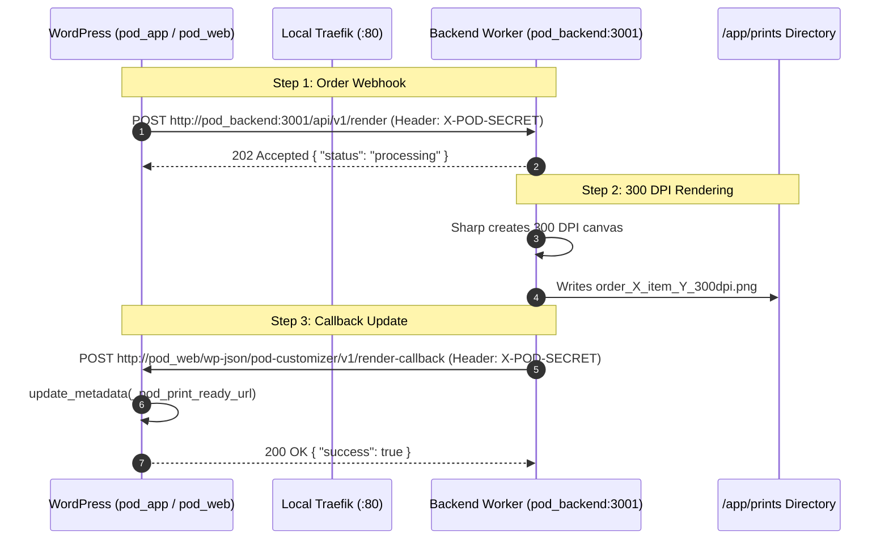
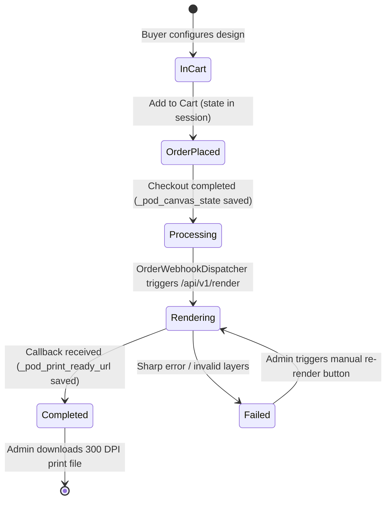

# Technical Plan: Automated End-to-End Order-to-Print Flow

**Feature Key**: `005-e2e-order-to-print-flow`  
**Related Spec**: [`./spec.md`](./spec.md)  
**Status**: `READY_FOR_REVIEW`  

---

## 1. Network Topology & Container Communication

In Docker local development, communication occurs across two distinct paths:

> [!IMPORTANT]
> - Container-to-container calls inside the `proxy_network` must use internal Docker service hostnames (`http://pod_backend:3001` and `http://pod_web/`) to avoid external DNS or loopback hairpinning limitations on localhost.
> - Client browser downloads access external URLs via Traefik: `http://pod-backend.localhost/prints/...` and `http://pod.localhost/`.

---

## 2. Shared Authentication Configuration

Both ends must share identical secret tokens:
- **WordPress**: `pod_customizer_secret_key` in `wp_options` (or via constant/admin settings).
- **Node.js**: `SHARED_SECRET=pod_dev_secret_key_2026` in `pod-backend.localhost/.env`.

---

## 3. Order Item Meta Lifecycle State Machine

---

## 4. Acceptance Criteria

1. An order placed with personalized parameters triggers an automated webhook to Node.js backend.
2. A valid PNG file with 300 DPI metadata is written to `pod-backend.localhost/storage/prints/`.
3. The order item in WooCommerce Admin displays an active download link leading to the high-res file.
4. The downloaded image contains composite layers (mockup, clipart, styled text) matching the customer's design.
