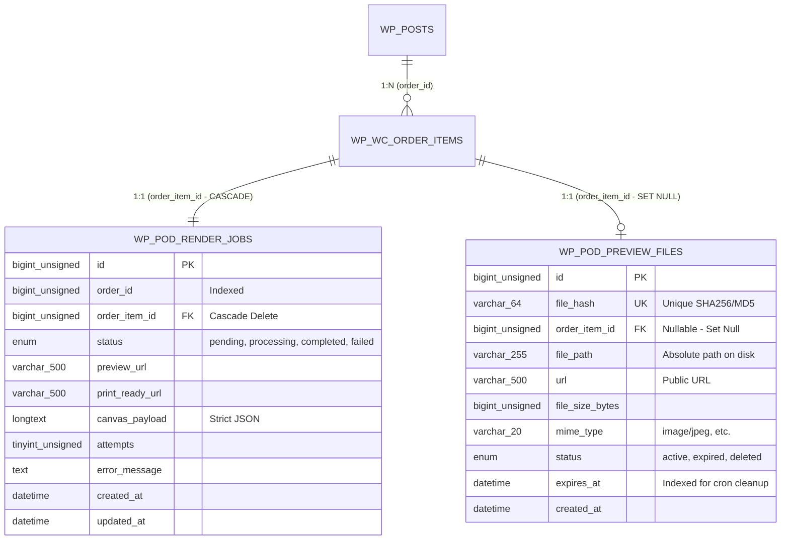

# Technical Plan: Custom Database Storage & Dedicated Tables

**Feature Key**: `006-custom-database-tables`  
**Related Spec**: [`./spec.md`](./spec.md)  
**Status**: `READY_FOR_REVIEW`  

---

## 1. Relational Database Schema & Foreign Key Graph



---

## 2. Table DDL Specifications (MySQL 8.4)

### 2.1 Table `{$wpdb->prefix}pod_render_jobs`

```sql
CREATE TABLE IF NOT EXISTS `{$wpdb->prefix}pod_render_jobs` (
    `id` BIGINT UNSIGNED NOT NULL AUTO_INCREMENT,
    `order_id` BIGINT UNSIGNED NOT NULL,
    `order_item_id` BIGINT UNSIGNED NOT NULL,
    `status` ENUM('pending', 'processing', 'completed', 'failed') NOT NULL DEFAULT 'pending',
    `preview_url` VARCHAR(500) NULL,
    `print_ready_url` VARCHAR(500) NULL,
    `canvas_payload` LONGTEXT NOT NULL,
    `attempts` TINYINT UNSIGNED NOT NULL DEFAULT 0,
    `error_message` TEXT NULL,
    `created_at` DATETIME NOT NULL DEFAULT CURRENT_TIMESTAMP,
    `updated_at` DATETIME NOT NULL DEFAULT CURRENT_TIMESTAMP ON UPDATE CURRENT_TIMESTAMP,
    PRIMARY KEY (`id`),
    UNIQUE KEY `uk_pod_order_item` (`order_item_id`),
    KEY `idx_pod_order_id` (`order_id`),
    KEY `idx_pod_status` (`status`),
    KEY `idx_pod_created_at` (`created_at`),
    CONSTRAINT `fk_pod_jobs_order_item`
        FOREIGN KEY (`order_item_id`)
        REFERENCES `{$wpdb->prefix}woocommerce_order_items` (`order_item_id`)
        ON DELETE CASCADE
        ON UPDATE CASCADE
) ENGINE=InnoDB DEFAULT CHARSET=utf8mb4 COLLATE=utf8mb4_unicode_ci;
```

---

### 2.2 Table `{$wpdb->prefix}pod_preview_files`

```sql
CREATE TABLE IF NOT EXISTS `{$wpdb->prefix}pod_preview_files` (
    `id` BIGINT UNSIGNED NOT NULL AUTO_INCREMENT,
    `file_hash` VARCHAR(64) NOT NULL,
    `order_item_id` BIGINT UNSIGNED NULL,
    `file_path` VARCHAR(255) NOT NULL,
    `url` VARCHAR(500) NOT NULL,
    `file_size_bytes` BIGINT UNSIGNED NOT NULL DEFAULT 0,
    `mime_type` VARCHAR(30) NOT NULL DEFAULT 'image/jpeg',
    `status` ENUM('active', 'expired', 'deleted') NOT NULL DEFAULT 'active',
    `expires_at` DATETIME NOT NULL,
    `created_at` DATETIME NOT NULL DEFAULT CURRENT_TIMESTAMP,
    PRIMARY KEY (`id`),
    UNIQUE KEY `uk_pod_file_hash` (`file_hash`),
    KEY `idx_pod_preview_order_item` (`order_item_id`),
    KEY `idx_pod_preview_expires` (`status`, `expires_at`),
    CONSTRAINT `fk_pod_previews_order_item`
        FOREIGN KEY (`order_item_id`)
        REFERENCES `{$wpdb->prefix}woocommerce_order_items` (`order_item_id`)
        ON DELETE SET NULL
        ON UPDATE CASCADE
) ENGINE=InnoDB DEFAULT CHARSET=utf8mb4 COLLATE=utf8mb4_unicode_ci;
```

---

## 3. Migration Architecture & Safe Execution

1. **WordPress `dbDelta` Integration**:
   - `MigrationManager::migrate()` will be called upon plugin activation and when `POD_DB_VERSION` increments.
   - Initial table schema is parsed through WordPress `dbDelta()`.
2. **Foreign Key Idempotency**:
   - Because `dbDelta` does not natively handle `FOREIGN KEY` constraints, `MigrationManager` executes a secondary check against `information_schema.TABLE_CONSTRAINTS` to conditionally add missing FKs without failing on upgrades.
3. **Repository Pattern & Single Responsibility**:
   - `RenderJobRepository`: Handles atomic insertion, status updates, attempt increments, and joins.
   - `PreviewFileRepository`: Replaces disk directory scans with fast indexed queries: `SELECT * FROM {$table} WHERE status = 'active' AND expires_at < NOW()`.

---

## 4. Rollback & Uninstallation Safety

- Uninstall hook checks a settings flag: `pod_drop_tables_on_uninstall` (defaults to `false` to avoid accidental data loss).
- If enabled, tables are dropped in reverse dependency order (`pod_preview_files`, `pod_render_jobs`).
