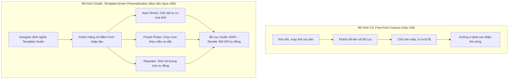

# Feature Specification: 008 - Template-Driven Personalizer, Form-Driven Storefront & Admin Configuration

**Spec Key**: `008-admin-product-designer-config`  
**Status**: `APPROVED_FOR_POC`  
**Created At**: 2026-09-17  
**Last Updated**: 2026-09-17  
**Reference Document**: [`.specify/template_personalization_requirements.md`](../../.specify/template_personalization_requirements.md)

---

## 1. Bối cảnh & Bước chuyển định hướng (Paradigm Shift)

Qua phân tích thực tế sản phẩm POD thương mại, hệ thống **chuyển hướng dứt khoát** từ mô hình *"Canvas vẽ/kéo thả tự do"* (Free-form editor) sang mô hình **"Cá nhân hóa theo Mẫu thiết kế chuẩn xưởng in" (Template-Driven Personalization)**:



### 1.1 Các nguyên tắc bất biến (Core Invariants)
1. **Khung chữ nhật 2D (Pure 2D Rectangular Bounds)**: Toàn bộ thiết kế nằm trong một hoặc nhiều vùng in hình chữ nhật 2D cố định trên phôi sản phẩm (Áo, Cốc, Túi, Tranh canvas). Chưa làm 3D ở giai đoạn này.
2. **Khóa ảnh nền (Fixed Background Art)**: Khách hàng không được và không cần thay đổi ảnh nền chính của sản phẩm.
3. **Không kéo thả ảnh tự do (No Free-form Drag & Drop)**: Loại bỏ tính năng kéo thả, phóng to, xoay ảnh tùy tiện của khách hàng.
4. **Form-Driven UI**: Khách hàng tương tác qua form nhập liệu trực quan (nhập text, chọn số lượng, bấm chọn icon có sẵn). Màn hình canvas 2D đóng vai trò Preview tự động cập nhật thời gian thực (Live WYSIWYG).
5. **Hỗ trợ Chữ xoay góc (Rotated Text) & Loại trừ Chữ cong (Curved Text - Out of Scope)**:
   - *Chữ xoay góc (`rotation: deg`)*: Hỗ trợ đầy đủ (xoay nghiêng -15°, 45°, 90°). Canvas Fabric.js và Sharp SVG đều hỗ trợ gốc.
   - *Chữ uốn cong (Curved Text / Text on Path)*: **Loại bỏ hoàn toàn khỏi phạm vi dự án** để tránh rủi ro biến dạng kerning, lỗi font tiếng Việt khi auto-shrink và sai lệch giữa browser với backend render.
6. **Chiến lược triển khai POC First**: Xây dựng bản thử nghiệm tương tác (POC) trên Storefront và kết nối Render Backend 300 DPI trước với các file Template mẫu để kiểm chứng thực tế và hoàn thiện JSON Schema. Sau khi Schema đã được chuẩn hóa và đóng băng mới bắt tay vào làm giao diện WP-Admin.

---

## 2. Phân loại thành phần tùy biến (The 3 Core Field Types)

Mọi sản phẩm POD trong hệ thống đều được cấu thành từ 3 loại thành phần tùy biến cốt lõi:

| STT | Loại Field (`type`) | Mô tả & Cách hoạt động | Ví dụ thực tế |
| :---: | :--- | :--- | :--- |
| **1** | **`text`** *(Text Slot)* | Ô nhập chữ vào vị trí cố định, có **Auto-shrink** (chữ dài tự co nhỏ font để không tràn khung) và hỗ trợ xoay góc (`rotation`). | Tên người nhận, năm sinh, câu trích dẫn, lời chúc. |
| **2** | **`preset_picker`** *(Chọn icon/ảnh)* | Chọn 1 hình ảnh từ danh sách định sẵn (bấm swatch hoặc dropdown), **không cho upload bừa bãi**. | Chọn cung hoàng đạo, chọn biểu tượng vương miện/ngôi sao, chọn giống chó/mèo. |
| **3** | **`repeater_counter`** *(Số lượng lặp)* | Nhập một con số $N$ $\rightarrow$ Tự động sinh và dàn đều $N$ hình ảnh nhỏ trong khung quy định. | Nhập số tuổi $\rightarrow$ vẽ $N$ cây nến; nhập số con $\rightarrow$ vẽ $N$ bàn chân gấu. |

*(Ngoài ra có tùy chọn **`color_swatch`** ở cấp độ phôi áo/cốc: khách chọn màu Áo Trắng hay Đen thì đổi ảnh nền mockup).*

---

## 3. Kiến trúc File Template Mẫu (Template Catalog Architecture)

Thay vì hardcode cứng vào mã nguồn, các mẫu thiết kế được định nghĩa dưới dạng file JSON chuẩn hóa lưu tại:
`wp-content/plugins/pod-customizer/templates/`

```text
wp-content/plugins/pod-customizer/templates/
├── tpl_01_text_autofit.json       # Mẫu 1: Chỉ có Text + Auto-shrink (Áo in tên/slogan)
├── tpl_02_preset_picker.json      # Mẫu 2: Text + Bảng chọn Icon có sẵn (Cốc Cung hoàng đạo)
└── tpl_03_birthday_candles.json   # Mẫu 3: Combo đầy đủ: Text + Bộ đếm N cây nến Repeater + Icon
```

### Cơ chế nạp & kiểm thử linh hoạt:
- **Nạp qua tham số URL khi test**: `http://pod.localhost/product/custom-t-shirt/?pod_tpl=tpl_03`
- **Nạp qua Product Meta**: Mỗi sản phẩm trong WooCommerce có thể chọn mẫu template tương ứng.

---

## 4. Đặc tả Hợp đồng dữ liệu (Data Contracts)

### 4.1 Cấu trúc Template Mẫu (`template_config.json`)

```json
{
  "template_id": "tpl_birthday_mug_01",
  "product_title": "Personalized Birthday Candle Mug",
  "print_spec": {
    "width_px": 2400,
    "height_px": 1050,
    "dpi": 300
  },
  "mockup": {
    "url": "/wp-content/plugins/pod-customizer/assets/mockups/mug-white.svg",
    "bounds": { "x": 300, "y": 200, "width": 1800, "height": 700 }
  },
  "fields": [
    {
      "id": "recipient_name",
      "type": "text",
      "label": "Tên người nhận",
      "placeholder": "Ví dụ: Nam Anh",
      "default_value": "Alex",
      "position": { "x": 1200, "y": 420 },
      "style": {
        "font_family": "Montserrat",
        "font_weight": "700",
        "font_size_px": 64,
        "min_font_size_px": 24,
        "color": "#1e293b",
        "align": "center",
        "max_width_px": 700,
        "rotation": 0
      }
    },
    {
      "id": "custom_message",
      "type": "text",
      "label": "Lời chúc mừng",
      "placeholder": "Ví dụ: Chúc mừng sinh nhật!",
      "default_value": "Happy Birthday!",
      "position": { "x": 1200, "y": 500 },
      "style": {
        "font_family": "Dancing Script",
        "font_weight": "600",
        "font_size_px": 44,
        "min_font_size_px": 20,
        "color": "#e11d48",
        "align": "center",
        "max_width_px": 600,
        "rotation": -5
      }
    },
    {
      "id": "candle_count",
      "type": "repeater_counter",
      "label": "Số tuổi (Số lượng cây nến)",
      "default_value": 5,
      "min": 1,
      "max": 18,
      "sub_image": {
        "url": "/wp-content/plugins/pod-customizer/assets/cliparts/candle.svg",
        "width_px": 36,
        "height_px": 72
      },
      "container_bounds": {
        "x": 850,
        "y": 320,
        "width_px": 700,
        "height_px": 80,
        "distribution": "horizontal_center_gap"
      }
    },
    {
      "id": "badge_icon",
      "type": "preset_picker",
      "label": "Biểu tượng yêu thích",
      "default_value": "crown",
      "position": { "x": 1200, "y": 240, "width_px": 60, "height_px": 60 },
      "options": [
        { "id": "crown", "label": "Vương miện", "url": "/wp-content/plugins/pod-customizer/assets/cliparts/crown.svg" },
        { "id": "star", "label": "Ngôi sao", "url": "/wp-content/plugins/pod-customizer/assets/cliparts/star.svg" },
        { "id": "heart", "label": "Trái tim", "url": "/wp-content/plugins/pod-customizer/assets/cliparts/heart.svg" },
        { "id": "paw", "label": "Dấu chân thú", "url": "/wp-content/plugins/pod-customizer/assets/cliparts/paw.svg" }
      ]
    }
  ]
}
```

### 4.2 Dữ liệu tùy biến của Khách hàng (`personalization_state.json`)

```json
{
  "template_id": "tpl_birthday_mug_01",
  "values": {
    "recipient_name": "Nguyễn Hoàng Nam Anh",
    "custom_message": "Happy 10th Birthday!",
    "candle_count": 10,
    "badge_icon": "crown"
  },
  "calculated_metrics": {
    "recipient_name": {
      "effective_font_size": 38.5,
      "is_shrunk": true
    }
  }
}
```

---

## 5. Các lưu ý kỹ thuật cốt lõi (Technical Considerations)

1. **Đồng bộ Font chữ giữa Browser và Backend (Font Parity)**:
   - Trình duyệt nạp Google Fonts, trong khi backend Sharp (Node.js) cần nạp file `.ttf` tương ứng trong thư mục `src/assets/fonts/`.
   - Storefront bắt buộc chờ `document.fonts.ready` trước khi đo độ dài chữ (`measureText`), đảm bảo tính toán Auto-Shrink không bị sai lệch.
2. **Hệ tọa độ chuẩn 300 DPI (Design Units & Scaling)**:
   - Tất cả tọa độ `(x, y)`, `fontSize`, `maxWidth`, `bounds` trong Template JSON đều lấy đơn vị pixel chuẩn in 300 DPI (ví dụ `2400 x 1050 px`).
   - Storefront chỉ việc nhân với tỷ lệ `scaleFactor = canvas_display_width / design_width` để render preview. Backend Sharp giữ nguyên tỷ lệ `1.0` để xuất file chuẩn nét.
3. **Điểm neo căn giữa Text (Anchor Point / OriginX)**:
   - Các text slot căn giữa (`align: 'center'`) sử dụng điểm neo tâm (`originX: 'center'`). Khi chữ dài ra hoặc co lại theo auto-shrink, text co đều về 2 bên từ tâm, không bị xô lệch.
4. **Xử lý ký tự tiếng Việt & XML Escaping cho SVG**:
   - Khi render SVG trên Backend Sharp, toàn bộ chuỗi ký tự phải được escape XML (`&` $\rightarrow$ `&amp;`, `<` $\rightarrow$ `&lt;`, `>` $\rightarrow$ `&gt;`), đảm bảo tương thích hoàn hảo với tiếng Việt có dấu.
5. **Ràng buộc và Validation cho Repeater**:
   - Trường nhập số lượng (như số cây nến) phải có giới hạn chặn trên và chặn dưới (`min: 1`, `max: 20`, `step: 1`).
   - Giao diện có nút stepper `[-]` và `[+]` để khách thao tác thuận tiện trên mobile.
6. **Tối ưu trải nghiệm di động (Mobile-First & Input Debouncing)**:
   - Bố trí form nhập liệu gọn gàng ngay dưới Canvas Preview.
   - Áp dụng Debounce (50 - 100ms) khi gõ phím để preview mượt mà không gây giật lag trên thiết bị di động.

---

## 6. Lộ trình triển khai theo từng giai đoạn (Implementation Phases)

* **Phase 1: Tạo Thư mục Template Mẫu & Định nghĩa Schema (Template Catalog)**:
  - Tạo thư mục `wp-content/plugins/pod-customizer/templates/`.
  - Khởi tạo 3 file JSON template mẫu (`tpl_01`, `tpl_02`, `tpl_03`).
  - Xây dựng lớp nạp template `TemplateLoader.php` hỗ trợ nạp qua URL param `?pod_tpl=...` hoặc Product Meta.

* **Phase 2: Xây dựng Storefront Form-Driven Engine (Frontend)**:
  - Dựng giao diện Form nhập liệu động tự sinh ra theo các `fields` trong template JSON.
  - Viết thuật toán **Auto-Shrink Text** trên Fabric.js.
  - Viết thuật toán **Repeater Distribution** xếp dàn đều $N$ icon.
  - Viết component chọn **Preset Icon Swatches**.

* **Phase 3: Nâng cấp Backend Sharp 300 DPI Compositor (Backend)**:
  - Cập nhật engine Sharp để nhận diện template và áp dụng thuật toán Auto-Shrink (SVG text co giãn) và xếp dàn cây nến thành phẩm 300 DPI.
  - Cài đặt font chữ `.ttf` trong container `pod_backend`.

* **Phase 4: Kiểm thử E2E & Đóng băng Schema (Verification & Freeze)**:
  - Kiểm tra 3 mẫu template trên Storefront và xuất file in 300 DPI.
  - Đảm bảo độ sắc nét và sự đồng bộ 100% giữa màn hình khách và file in.

* **Phase 5: Xây dựng giao diện Quản trị WP-Admin (Admin UI)**:
  - Dựng Meta Box trong trang Edit Product để Admin tự cấu hình các template dựa trên Schema đã được chứng minh thành công.
