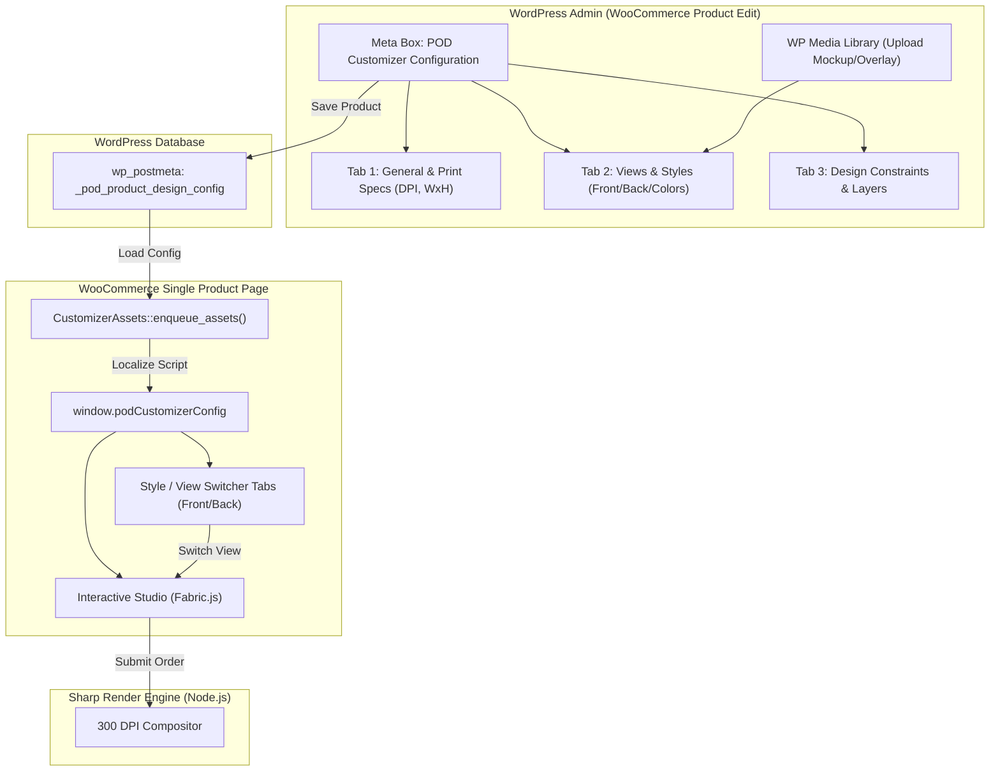

# Feature Specification: 008 - Admin Product Designer Configuration & Multi-Style Storefront Bridge

**Spec Key**: `008-admin-product-designer-config`  
**Status**: `DRAFT / LIVING_SPECIFICATION`  
**Created At**: 2026-09-17  
**Last Updated**: 2026-09-17  

---

## 1. Bối cảnh & Vấn đề thực tế (Problem Statement & Purpose)

> [!IMPORTANT]
> Toàn bộ danh mục trường hợp nghiệp vụ chi tiết (Auto-shrink text, Dynamic Repeater sub-images, Preset icon options, Pure 2D rectangular boundaries) và lý do chuyển dịch sang mô hình POC-First được tài liệu hóa tại [**`.specify/template_personalization_requirements.md`**](../../.specify/template_personalization_requirements.md).

### 1.1 Vấn đề hiện tại
Hiện nay trong plugin `pod-customizer`, hệ thống đang sử dụng cấu hình mẫu dùng chung (hardcoded mockups và kích thước 1200x1200px mặc định). Tuy nhiên, trên một website POD (Print-On-Demand) thực tế:
1. **Mỗi sản phẩm có kích thước & quy cách in riêng biệt**:
   - Áo thun (T-Shirt): Vùng in 4500 x 5400 px (15" x 18" @ 300 DPI).
   - Cốc sứ (Mug): Vùng in 2400 x 1050 px (Wrap-around 8" x 3.5" @ 300 DPI).
   - Túi vải (Tote Bag): Vùng in 3600 x 4200 px (12" x 14" @ 300 DPI).
   - Tranh Canvas: Vùng in theo tỷ lệ khung viền cụ thể.
2. **Một sản phẩm có nhiều kiểu dáng / mặt in (Multi-Style / Multi-View)**:
   - In mặt trước (Front), mặt sau (Back), tay áo (Left/Right Sleeve).
   - Nhiều biến thể màu sắc phôi (Trắng, Đen, Xám, Xanh Navy...).
3. **Admin cần công cụ trực quan để cấu hình**:
   - Quản trị viên phải cấu hình được phôi ảnh thiết kế (Mockup), vùng in (Print Area Bounds) và quy cách in trực tiếp trong trang quản trị sản phẩm WooCommerce (`Edit Product`).
4. **Cấu hình trong Admin phải tự động phản ánh ra ngoài Storefront**:
   - Giao diện Customizer bên ngoài (Storefront UI) phải tải chính xác danh sách kiểu dáng, màu sắc, phôi thiết kế và giới hạn vùng in tương ứng của sản phẩm đang xem.
5. **Khả năng mở rộng theo thời gian (Extensibility)**:
   - Theo yêu cầu của dự án, người dùng sẽ bổ sung dần dần các tùy chọn sau này (font chữ riêng theo sản phẩm, thư viện clipart theo category, pricing theo layer, v.v.). Do đó, kiến trúc dữ liệu và giao diện cấu hình phải được module hóa dạng **Schema-driven** và có các hook points mở rộng linh hoạt.

---

## 2. Kiến trúc giải pháp (Architecture & Data Flow)

### 2.1 Luồng dữ liệu tổng quan (Data Flow Architecture)



---

## 3. Cấu trúc dữ liệu cấu hình sản phẩm (Schema Definition)

Dữ liệu cấu hình cho mỗi sản phẩm được lưu trữ tại postmeta key: `_pod_product_design_config` dưới dạng mảng JSON chuẩn hóa:

```json
{
  "enabled": true,
  "product_type": "apparel",
  "print_spec": {
    "dpi": 300,
    "width_px": 4500,
    "height_px": 5400,
    "unit": "px",
    "export_format": "png",
    "bleed_margin_px": 0
  },
  "views": [
    {
      "id": "front",
      "name": "Front Side (Mặt trước)",
      "is_default": true,
      "mockup_image_url": "http://pod.localhost/wp-content/uploads/2026/09/tshirt-front-white.png",
      "mockup_image_id": 128,
      "overlay_image_url": "",
      "canvas_bounds": {
        "x": 300,
        "y": 250,
        "width": 600,
        "height": 720,
        "unit": "px"
      },
      "color_variants": [
        { "id": "white", "name": "White", "hex": "#ffffff", "mockup_url": "http://pod.localhost/uploads/tshirt-white.png" },
        { "id": "black", "name": "Black", "hex": "#18181b", "mockup_url": "http://pod.localhost/uploads/tshirt-black.png" }
      ]
    },
    {
      "id": "back",
      "name": "Back Side (Mặt sau)",
      "is_default": false,
      "mockup_image_url": "http://pod.localhost/wp-content/uploads/2026/09/tshirt-back-white.png",
      "mockup_image_id": 129,
      "overlay_image_url": "",
      "canvas_bounds": {
        "x": 300,
        "y": 200,
        "width": 600,
        "height": 750,
        "unit": "px"
      },
      "color_variants": []
    }
  ],
  "permissions": {
    "allow_custom_text": true,
    "allow_clipart": true,
    "allow_photo_upload": true,
    "max_uploaded_photos": 5,
    "max_file_size_mb": 25,
    "allowed_file_types": ["image/png", "image/jpeg", "image/svg+xml"]
  },
  "extensions": {}
}
```

> [!NOTE]
> Khóa `extensions` là đối tượng JSON mở rỗng, được chuẩn bị sẵn để bổ sung thêm các tính năng tuỳ biến trong tương lai theo đúng định hướng *"bổ sung dần dần sau này"* mà không làm phá vỡ cấu trúc cơ sở dữ liệu cũ.

---

## 4. Giao diện quản trị Admin (Product Edit Screen)

### 4.1 Vị trí tích hợp
* Tích hợp trực tiếp vào trang **Chỉnh sửa sản phẩm WooCommerce** (`post.php?post=...&action=edit`).
* Sử dụng **WooCommerce Product Data Tabs** (`woocommerce_product_data_tabs` và `woocommerce_product_data_panels`) hoặc một **Meta Box** chuyên dụng `🎨 POD Customizer Studio Config` nằm ngay dưới phần dữ liệu sản phẩm.

### 4.2 Các phân khu chức năng (Admin Modules)

#### Phân khu 1: Kích hoạt & Thông số in (General & Print Specs)
* **Bật/Tắt tính năng Customizer cho sản phẩm**: Checkbox `Enable POD Customizer for this product`.
* **Preset nhanh**: Lựa chọn nhanh mẫu chuẩn (T-Shirt 4500x5400, Mug 2400x1050, Tote Bag 3600x4200, Poster A3 3508x4960, Custom).
* **Thông số DPI**: Mặc định `300 DPI` (chuẩn xưởng in).
* **Kích thước file in ấn (Pixel / mm)**: Chiều rộng (Width px) và Chiều cao (Height px).

#### Phân khu 2: Quản lý các mặt in & Kiểu dáng (Views & Styles Manager)
* **Danh sách các mặt in (Views)**:
  * Cho phép thêm nhiều mặt (Front, Back, Sleeve, Left View, Right View...).
  * Mỗi mặt in gồm:
    * **Tên hiển thị** (vd: Mặt trước, Mặt sau).
    * **Phôi Mockup sản phẩm**: Nút chọn/tải ảnh từ **WordPress Media Library** (`wp.media`).
    * **Vùng in ấn (Print Area Bounding Box)**:
      * Tọa độ `X`, `Y`, Chiều rộng `Width`, Chiều cao `Height` (hoặc % so với kích thước mockup).
      * Có chế độ xem trước (Mini Interactive Preview) giúp Admin canh chỉnh vùng in chuẩn xác lên áo/cốc.
    * **Biến thể màu sắc phôi (Color Variants)** (tùy chọn):
      * Thêm màu sắc phôi (Mã màu HEX + Ảnh mockup tương ứng cho màu đó).

#### Phân khu 3: Quyền hạn & Giới hạn thao tác (Permissions & Rules)
* Cho phép / Khóa tính năng thêm Text (`allow_custom_text`).
* Cho phép / Khóa tính năng chọn Clipart (`allow_clipart`).
* Cho phép / Khóa tính năng tải ảnh cá nhân (`allow_photo_upload`).
* Giới hạn dung lượng ảnh upload tối đa (MB).

#### Phân khu 4: Khung mở rộng (Extensibility Placeholder)
* Khu vực dành riêng để bổ sung dần các chức năng mới theo yêu cầu:
  * Thư viện Clipart riêng cho từng danh mục sản phẩm.
  * Bộ font chữ giới hạn riêng cho từng sản phẩm.
  * Tính phụ phí (Surcharge / Extra Price) theo số lượng mặt in hoặc số layer.

---

## 5. Cầu nối đồng bộ ra Storefront (Frontend Integration)

### 5.1 Đọc cấu hình động
* Tại `CustomizerAssets::enqueue_assets()`:
  * Đọc `_pod_product_design_config` từ sản phẩm hiện tại.
  * Nếu sản phẩm chưa có cấu hình riêng: Dùng cấu hình fallback thông minh (Default T-Shirt).
  * Chuyển đổi toàn bộ mảng `views`, `canvas_bounds`, `permissions` vào biến JavaScript toàn cục:
    ```javascript
    window.podCustomizerConfig = {
        productId: 123,
        productConfig: { ... }, // Cấu hình từ Admin
        activeViewId: 'front',
        ...
    };
    ```

### 5.2 Bộ chuyển đổi mặt in & kiểu dáng ở Storefront (Multi-View Switcher)
* Trên thanh công cụ giao diện thiết kế phía khách hàng:
  * Tự động hiển thị thanh chuyển đổi mặt in (Tabs: `Mặt trước` / `Mặt sau` / `Tay áo`...) dựa trên danh sách `views` Admin đã cấu hình.
  * Khi khách click đổi mặt:
    1. Lưu trạng thái canvas của mặt hiện tại vào bộ nhớ tạm.
    2. Đổi ảnh nền Mockup sang mặt mới.
    3. Cập nhật kích thước vùng in Canvas (`pod-canvas-wrapper`) tương ứng với `canvas_bounds` của mặt mới.
    4. Nạp lại các layer đã thiết kế của mặt đó (hoặc hiển thị canvas trống nếu chưa thiết kế).

### 5.3 Xuất file đơn hàng đa mặt in (Order Payload Generation)
* Khi khách hàng bấm **"Thêm vào giỏ hàng"**:
  * Lưu trữ cấu hình canvas của **toàn bộ các mặt in** đã thiết kế vào `_pod_canvas_state`.
  * Bộ Render Backend sẽ nhận diện và render ra đầy đủ các file in ấn 300 DPI tương ứng cho từng mặt (Front, Back...) và đóng gói chung vào file ZIP xuất xưởng.

---

## 6. Kế hoạch triển khai theo từng giai đoạn (Phased Implementation Roadmap)

Để đảm bảo tính vững chắc và dễ dàng bổ sung tính năng dần dần:

* **Phase 1: Nền tảng cấu hình Admin & Database Meta (Foundation)**
  - Tạo cấu trúc lớp `ProductConfigManager.php` và `ProductMetaBox.php`.
  - Đăng ký lưu dữ liệu an toàn (`wp_nonce`, sanitization, schema validation).
  - Tích hợp WordPress Media Uploader (`wp.media`) để chọn ảnh Mockup.

* **Phase 2: Bộ nạp cấu hình động sang Storefront (Data Bridge)**
  - Cập nhật `CustomizerAssets.php` và `CustomizerRenderer.php` để lấy dữ liệu từ `_pod_product_design_config`.
  - Nâng cấp `pod-customizer.js` để đọc `canvas_bounds` và `mockup_image_url` riêng của từng sản phẩm.

* **Phase 3: Giao diện chuyển đổi nhiều mặt in (Multi-View UI)**
  - Thêm thanh chuyển mặt in (Front / Back Switcher) trên Storefront Canvas.
  - Quản lý trạng thái đa view (Multi-View Canvas State Manager).

* **Phase 4: Các tính năng mở rộng bổ sung sau này (Future Incremental Extensions)**
  - Bổ sung tùy biến theo các yêu cầu tiếp theo của người dùng.
