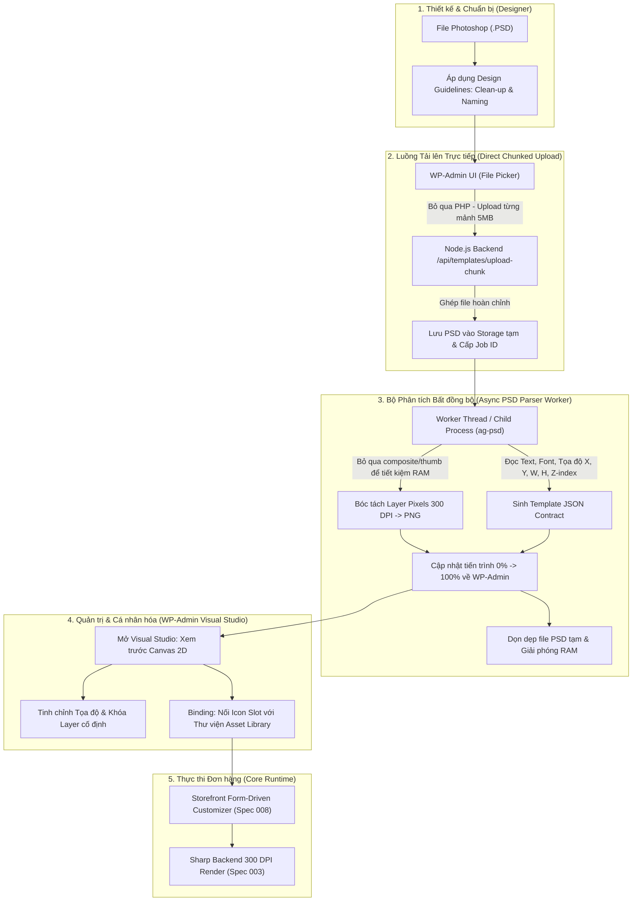

# Feature Specification: 009 - Admin Template Importer (PSD Direct Flow) with Large File Processing & Visual Field Binding

**Spec Key**: `009-admin-template-importer`  
**Status**: `PROPOSED` (Chưa triển khai - Đang ở giai đoạn thiết kế đặc tả)  
**Created At**: 2026-09-18  
**Last Updated**: 2026-09-18  
**Reference Documents**:
- Spec 008: [`specs/008-admin-product-designer-config/spec.md`](../008-admin-product-designer-config/spec.md)
- Serializer Contract: [`pod.localhost/.../serializer.js`](../../pod.localhost/source/wp-content/plugins/pod-customizer/assets/js/src/serializer.js)
- Backend Render Engine: [`pod-backend.localhost/.../sharpRenderer.js`](../../pod-backend.localhost/src/services/sharpRenderer.js)
- Database Schema: [`.specify/database.md`](../../.specify/database.md)
- Entities Definition: [`.specify/entities.md`](../../.specify/entities.md)

---

## 1. Bối cảnh & Định hướng chiến lược (Strategic Direction)

Trong các hệ sinh thái POD (Print-On-Demand) chuyên nghiệp (như Teeinblue, Customily), một sản phẩm cá nhân hóa thường bao gồm từ **10 đến 50+ layer đồ họa** (ảnh nền, họa tiết cố định, text slot tên/ngày tháng, các icon slot tùy biến tóc, màu da, áo, thú cưng...).

### Quyết định kỹ thuật cốt lõi:
1. **Lựa chọn File `.PSD` làm luồng nhập liệu chính (Primary Workflow)**:
   - File `.psd` mang theo đầy đủ: Cây thư mục (Group), thứ tự đè lớp (Z-index), tọa độ gốc $X, Y$, kích thước $W, H$, góc xoay và các thuộc tính font chữ.
   - Designer chỉ cần bấm `Ctrl + S` trong Photoshop là có thể đưa file lên hệ thống, không cần xuất tay từng layer ảnh.
2. **Nguyên lý: "Quy ước thiết kế" + "Backend Node.js bóc tách tự động"**:
   - Designer tuân theo một bộ quy ước đặt tên (Naming Rules) và quy tắc làm sạch file (Clean-up Rules).
   - Backend Node.js chịu trách nhiệm phân tích nhị phân file PSD, cắt các layer ra ảnh PNG trong suốt 300 DPI, và tự sinh file cấu hình JSON chuẩn hóa.
3. **Giải quyết triệt để bài toán: File PSD dung lượng lớn (100MB - 600MB)**:
   - Bỏ qua PHP/WordPress upload timeout bằng cơ chế **Upload trực tiếp sang Node.js theo từng mảnh (Chunked / Resumable Upload)**.
   - Xử lý bất đồng bộ qua **Hàng đợi ngầm (Asynchronous Job Queue)** với thanh tiến trình trực quan (Progress Bar).
   - Tối ưu giải phóng RAM với tiến trình con (Child Process) và thư viện `ag-psd`.



---

## 2. Giải pháp Kiến trúc Xử lý File PSD Dung lượng Lớn

File thiết kế áo $4500 \times 5400\text{ px} @ 300\text{ DPI}$ có thể rất nặng. Hệ thống áp dụng 4 lớp giải pháp:

### 2.1 Luồng Tải lên Trực tiếp qua Phân mảnh (Direct-to-Backend Chunked Upload)
* **Bypass PHP:** Trình duyệt phía WP-Admin sẽ không post file qua PHP `admin-ajax.php` hay REST API của WordPress để tránh các giới hạn `upload_max_filesize = 2M/64M` và `max_execution_time = 30s`.
* **Phân mảnh (Chunking):** Trình duyệt chia file PSD thành các lát nhỏ $5\text{MB} - 10\text{MB}$ gửi tuần tự đến endpoint `POST /api/templates/upload-chunk` của Node.js:
  * Cho phép dừng và tiếp tục (Resumable) nếu đường truyền internet của Admin bị ngắt quãng.
  * Hiển thị phần trăm upload mượt mà ($0\% \rightarrow 100\%$).
  * Sau khi nhận đủ các lát, Node.js tự động ghép lại thành file PSD hoàn chỉnh trên đĩa tạm.

### 2.2 Xử lý Bất đồng bộ qua Hàng đợi (Asynchronous Queue & Progress Polling)
* Không sử dụng cơ chế Blocking Request. Khi file tải lên hoàn tất, Node.js cấp một `job_id` và trả về phản hồi tức thì cho trình duyệt:
  ```json
  { "status": "queued", "job_id": "job_psd_98234", "message": "File uploaded successfully, parsing started." }
  ```
* Phía Admin hiển thị Modal tiến trình: *"Đang phân tích layer... 35%"*.
* Trình duyệt thực hiện polling nhẹ (mỗi 1.5s) hoặc qua Server-Sent Events (SSE) `/api/templates/jobs/:id/status`.
* Khi xử lý xong, server trả về Template JSON đã hoàn thiện $\rightarrow$ Trình duyệt tự đóng Modal và chuyển sang màn hình Canvas Visual Editor.

### 2.3 Tối ưu Bộ nhớ RAM trên Node.js (`ag-psd` Tuning)
* **Tùy chọn đọc tiết kiệm bộ nhớ:**
  ```javascript
  const psd = readPsd(buffer, {
    skipThumbnail: true,        // Bỏ qua thumbnail nhỏ không dùng
    skipCompositeImage: true,    // BỎ QUA ảnh phẳng tổng hợp (tiết kiệm 50MB - 150MB RAM)
    skipLayerImageData: false   // Chỉ giải mã pixel của các layer hiển thị
  });
  ```
* **Cách ly tiến trình (Child Process Isolation):**
  * Tác vụ parse PSD được thực hiện trong một **Child Process riêng biệt** (`fork()` một process con) hoặc Worker Thread.
  * Khi parse xong và lưu các file PNG xuống đĩa, Child Process lập tức kết thúc (`process.exit(0)`).
  * Đảm bảo hệ điều hành **thu hồi 100% RAM lập tức**, hoàn toàn không gây rò rỉ bộ nhớ (Memory Leak) cho tiến trình chính đang render đơn hàng của `sharpRenderer.js`.
* **Tự động dọn dẹp (Auto-cleanup):**
  * Sau khi bóc tách toàn bộ layer ra PNG và ghi file JSON, file `.psd` tạm trên ổ cứng sẽ được tự động xóa bỏ để tiết kiệm dung lượng đĩa.

---

## 3. Bộ Quy ước Thiết kế Chuẩn (PSD Design Guidelines)

Hệ thống cung cấp một bản hướng dẫn chuẩn ngắn gọn cho Designer nhằm tối ưu tốc độ và giảm 70% dung lượng file PSD:

### 3.1 Quy tắc Làm sạch File (Clean-up Rules)
1. **Rasterize Smart Objects**: Chuột phải vào các Smart Object chọn *Rasterize Layer*. Giúp loại bỏ các file gốc nhúng ẩn, giảm dung lượng PSD từ 400MB xuống còn 60MB - 90MB.
2. **Rasterize Layer Styles**: Các hiệu ứng như *Drop Shadow, Stroke, Outer Glow* cần được rasterize trực tiếp vào layer để tránh sai lệch hiệu ứng khi parse.
3. **Xóa Layer Ẩn (Hidden / Trash Layers)**: Xóa toàn bộ các layer nháp không dùng.
4. **Tắt "Maximize Compatibility"**: Khi chọn *Save As* trong Photoshop, bỏ chọn *Maximize Compatibility* để Photoshop không lưu thêm ảnh phẳng dự phòng.

### 3.2 Quy ước Tiền tố Đặt tên Layer & Folder Group (Naming Conventions)
Backend tự động dựa vào tên layer và folder group để phân loại thành phần trong Template JSON:

| Tiền tố trong Tên Layer / Folder | Kiểu phân loại (`type`) | Hành vi hệ thống & Nguyên tắc thiết kế |
| :--- | :--- | :--- |
| `[fixed] Layer Name` hoặc không tiền tố | `fixed_image` | Cắt thành PNG 300 DPI trong suốt, cố định vị trí, khách không được chỉnh sửa. |
| `[group:tên_nhóm] Folder Name` | `layer_selector` | **Gom nhóm Layer biến thể (Màu da, Kiểu tóc, Trang phục...)**: Toàn bộ layer con trong folder này được coi là các biến thể ảnh độc lập do Designer vẽ sẵn. **Tuyệt đối KHÔNG dùng mã màu HEX / Color Tint** để tránh biến dạng mảng sáng/tối; hệ thống tự động sinh bộ chọn (Swatches / Dropdown) ngoài Storefront để khách bật/tắt (toggle visibility) layer ảnh tương ứng. |
| `[text] Layer Name` | `text` | Nhận diện thành Text Slot cho khách gõ chữ: tự trích xuất Font, Size, Color hex, Alignment và kích thước khung Auto-shrink. |
| `[slot:icon] Layer Name` hoặc `[slot]` | `preset_picker` | Xác định vùng giữ chỗ (Placeholder) cho icon/clipart. Admin sẽ liên kết vùng này với Thư viện Asset ngoài (Zodiac, Thú cưng...). |
| `[repeater] Layer Name` | `repeater_counter` | Vùng sinh phần tử lặp tự động (ví dụ nến bánh sinh nhật, dấu chân thú cưng). |
| `[mockup]` | `mockup_base` | Lớp ảnh nền phôi sản phẩm để hiển thị trên trình duyệt (không tham gia vào file in xưởng). |

> [!IMPORTANT]
> **Nguyên tắc cốt lõi: 100% Layer-Driven cho Màu Da & Tóc**  
> Các thuộc tính mỹ thuật cá nhân hóa như Màu da (Skin tone), Kiểu tóc (Hair style), Màu tóc (Hair color) **bắt buộc phải là các Layer ảnh thực tế (PNG 300 DPI)** được Designer vẽ và tổ chức trong các folder `[group:...]`. Không sử dụng công cụ chọn mã màu (Color Picker) hay thuật toán phủ màu tự động (Color Tint) nhằm đảm bảo 100% độ sắc nét và màu sắc nguyên bản của tranh vẽ.

---

## 4. Phân Tích & Chiến Lược Lưu Trữ Hình Ảnh (Image Storage Architecture)

Một câu hỏi cốt lõi: **"Các ảnh bóc tách từ PSD có được lưu vào WordPress Media Library không?"**

### 4.1 Đánh giá rủi ro nếu lưu vào WP Media Library
Nếu mỗi file PSD bóc ra 20–30 layer ảnh PNG và tất cả đều insert vào Media Library (`wp_posts` với `post_type = 'attachment'`):
1. **Gây "rác" Media Library nghiêm trọng**: Thư viện ảnh của WordPress sẽ bị ngập tràn hàng trăm mảnh layer đồ họa vụn vặt, che lấp toàn bộ ảnh sản phẩm và bài viết chính.
2. **Lãng phí tài nguyên CPU/RAM và dung lượng đĩa**: WordPress sẽ tự động kích hoạt tiến trình tạo 4–6 thumbnail phái sinh (`-150x150`, `-300x300`, `-768x768`, `-1024x1024`...) cho mỗi layer 300 DPI.
3. **Khó dọn dẹp**: Khi xóa hoặc cập nhật một mẫu template, việc tìm và xóa hàng chục bản ghi `attachment` rải rác trong database là cực kỳ phức tạp và dễ sót dữ liệu mồ côi.

### 4.2 Giải pháp phân tầng lưu trữ chuẩn (Two-Tier Storage Architecture)

Hệ thống phân định ranh giới lưu trữ rõ ràng:

```text
wp-content/uploads/
├── [Tier 1: WP Media Library Thường]
│   ├── mockups/                  # Phôi áo, cốc sứ (dùng làm Featured Image WooCommerce)
│   └── pod-icons/                # Kho Clipart dùng chung Admin chủ động upload
│
└── [Tier 2: Dedicated POD Static Storage - Không đăng ký wp_posts]
    ├── pod-templates/
    │   └── {template_id}/
    │       └── layers/           # Toàn bộ layer PNG bóc tách từ PSD lưu trực tiếp tại đây
    ├── pod-previews/             # Ảnh snapshot canvas xem trước của khách (tự xóa sau 7 ngày)
    └── pod-prints/               # File in xuất xưởng 300 DPI (lưu theo đơn hàng: /year/month/order_id/)
```

| Loại hình ảnh | Vị trí lưu trữ | Có nằm trong WP Media Library? | Mục đích |
| :--- | :--- | :---: | :--- |
| **Ảnh Phôi Mockup (Áo/Cốc)** | `uploads/` (WP Media) | **CÓ** | Admin cần chọn làm ảnh đại diện sản phẩm WooCommerce, hiển thị ngoài trang danh mục cửa hàng. |
| **Icon / Clipart Thư viện dùng chung** | `uploads/pod-icons/` (WP Media) | **CÓ** | Admin upload qua trình quản lý Media của WP, dễ dàng phân loại theo Category. |
| **Các Layer PNG bóc tách từ PSD** | `uploads/pod-templates/{tpl_id}/layers/` | **KHÔNG** | Lưu dạng file tĩnh trực tiếp trên đĩa. Không sinh thumbnail, xóa template là xóa sạch cả thư mục trong 1 lệnh. |
| **Ảnh Preview & File in 300 DPI** | `uploads/pod-previews/` & `pod-prints/` | **KHÔNG** | Quản lý độc lập theo vòng đời đơn hàng (`PreviewStorageManager` & `PrintStorageManager`). |

---

## 5. Kiến Trúc & Luồng Dữ Liệu JSON Hai Chiều (Bidirectional JSON Contract)

Hệ thống sử dụng **JSON Schema chuẩn hóa làm ngôn ngữ chung duy nhất (Single Source of Truth)** giữa WordPress, Trình duyệt Storefront và Render Backend:

```text
========================================================================================
[CHIỀU 1: CẤU HÌNH TEMPLATE -> FRONT-END STOREFRONT]
1. Admin Import PSD -> Node.js xuất PNGs + sinh Template JSON
2. Template JSON lưu vào Product Meta: _pod_template_config
3. TemplateLoader.php nạp JSON -> window.podCustomizerConfig.template
4. Front-end (form.js) đọc fields -> Tự sinh Form (Text inputs, Preset Swatches, Counter)
5. Front-end (canvas.js) vẽ đối tượng lên Fabric.js và cập nhật live khi khách nhập liệu

========================================================================================
[CHIỀU 2: TRẠNG THÁI KHÁCH HÀNG -> BACKEND SHARP RENDER 300 DPI]
1. Khách bấm Add to Cart -> serializer.js xuất Canvas State JSON: { canvas, layers }
2. Lưu JSON vào Order Item Meta: _pod_canvas_state
3. Đơn hàng chuyển sang 'processing' -> OrderWebhookDispatcher.php bắn POST /api/v1/render
4. sharpRenderer.js tải ảnh theo layer.url, render chữ theo font/tọa độ -> 01_print_ready_300dpi.png
========================================================================================
```

### 5.1 Cấu trúc Template JSON Đầu ra (`_pod_template_config`)

Khớp 100% với hợp đồng dữ liệu của Spec 008, [serializer.js](file:///home/quyle91/projects/pod/pod.localhost/source/wp-content/plugins/pod-customizer/assets/js/src/serializer.js) và [database.md](file:///home/quyle91/projects/pod/.specify/database.md):

```json
{
  "template_id": "tpl_imported_mug_1726647600",
  "source_file": "birthday_mug_master.psd",
  "created_at": "2026-09-18T09:30:00Z",
  "print_spec": {
    "width_px": 2400,
    "height_px": 1050,
    "dpi": 300,
    "safe_zone_margin_px": 50
  },
  "mockup": {
    "base_url": "/wp-content/uploads/pod-templates/mockups/mug_white.png",
    "width": 600,
    "height": 600
  },
  "fields": [
    {
      "id": "skin_tone",
      "type": "layer_selector",
      "label": "Chọn màu da",
      "default_value": "layer_skin_fair",
      "display_type": "swatches",
      "options": [
        { "id": "fair", "label": "Da trắng", "layer_id": "layer_skin_fair", "thumbnail_url": "/uploads/pod-templates/tpl_01/thumbs/thumb_skin_fair.png" },
        { "id": "medium", "label": "Da tự nhiên", "layer_id": "layer_skin_medium", "thumbnail_url": "/uploads/pod-templates/tpl_01/thumbs/thumb_skin_medium.png" },
        { "id": "dark", "label": "Da ngăm", "layer_id": "layer_skin_dark", "thumbnail_url": "/uploads/pod-templates/tpl_01/thumbs/thumb_skin_dark.png" }
      ]
    },
    {
      "id": "hair_style",
      "type": "layer_selector",
      "label": "Kiểu & Màu tóc",
      "default_value": "layer_hair_bob_brown",
      "display_type": "dropdown",
      "options": [
        { "id": "bob_blonde", "label": "Tóc Bob - Vàng", "layer_id": "layer_hair_bob_blonde", "thumbnail_url": "/uploads/pod-templates/tpl_01/thumbs/thumb_bob_blonde.png" },
        { "id": "bob_brown", "label": "Tóc Bob - Nâu", "layer_id": "layer_hair_bob_brown", "thumbnail_url": "/uploads/pod-templates/tpl_01/thumbs/thumb_bob_brown.png" },
        { "id": "curly_black", "label": "Tóc Xoăn - Đen", "layer_id": "layer_hair_curly_black", "thumbnail_url": "/uploads/pod-templates/tpl_01/thumbs/thumb_curly_black.png" }
      ]
    },
    {
      "id": "slot_recipient_name",
      "type": "text",
      "label": "Tên người nhận",
      "default_value": "Jessica",
      "target_layer": "layer_text_name"
    },
    {
      "id": "slot_pet_icon",
      "type": "preset_picker",
      "label": "Biểu tượng thú cưng",
      "target_layer": "layer_slot_icon",
      "category_slug": "pets_dogs_cats"
    }
  ],
  "layers": [
    {
      "id": "layer_bg_fixed",
      "type": "fixed_image",
      "name": "[fixed] Background Frame",
      "url": "/wp-content/uploads/pod-templates/tpl_imported_mug_1726647600/layers/layer_01_bg.png",
      "x": 1200,
      "y": 525,
      "width": 2400,
      "height": 1050,
      "rotation": 0,
      "z_index": 1,
      "printable": true,
      "always_visible": true
    },
    {
      "id": "layer_skin_fair",
      "type": "image",
      "name": "[group:skin] Da trắng",
      "group_id": "skin_tone",
      "url": "/wp-content/uploads/pod-templates/tpl_imported_mug_1726647600/layers/skin_fair.png",
      "x": 600,
      "y": 500,
      "width": 1200,
      "height": 1800,
      "z_index": 2,
      "printable": true
    },
    {
      "id": "layer_skin_medium",
      "type": "image",
      "name": "[group:skin] Da tự nhiên",
      "group_id": "skin_tone",
      "url": "/wp-content/uploads/pod-templates/tpl_imported_mug_1726647600/layers/skin_medium.png",
      "x": 600,
      "y": 500,
      "width": 1200,
      "height": 1800,
      "z_index": 2,
      "printable": true
    },
    {
      "id": "layer_skin_dark",
      "type": "image",
      "name": "[group:skin] Da ngăm",
      "group_id": "skin_tone",
      "url": "/wp-content/uploads/pod-templates/tpl_imported_mug_1726647600/layers/skin_dark.png",
      "x": 600,
      "y": 500,
      "width": 1200,
      "height": 1800,
      "z_index": 2,
      "printable": true
    },
    {
      "id": "layer_hair_bob_blonde",
      "type": "image",
      "name": "[group:hair] Bob vàng",
      "group_id": "hair_style",
      "url": "/wp-content/uploads/pod-templates/tpl_imported_mug_1726647600/layers/hair_bob_blonde.png",
      "x": 750,
      "y": 420,
      "width": 900,
      "height": 850,
      "z_index": 3,
      "printable": true
    },
    {
      "id": "layer_hair_bob_brown",
      "type": "image",
      "name": "[group:hair] Bob nâu",
      "group_id": "hair_style",
      "url": "/wp-content/uploads/pod-templates/tpl_imported_mug_1726647600/layers/hair_bob_brown.png",
      "x": 750,
      "y": 420,
      "width": 900,
      "height": 850,
      "z_index": 3,
      "printable": true
    },
    {
      "id": "layer_hair_curly_black",
      "type": "image",
      "name": "[group:hair] Xoăn đen",
      "group_id": "hair_style",
      "url": "/wp-content/uploads/pod-templates/tpl_imported_mug_1726647600/layers/hair_curly_black.png",
      "x": 720,
      "y": 400,
      "width": 960,
      "height": 1100,
      "z_index": 3,
      "printable": true
    },
    {
      "id": "layer_text_name",
      "type": "text",
      "name": "[text] Recipient Name",
      "default_value": "Jessica",
      "font_family": "Dancing Script",
      "font_url": "/wp-content/uploads/pod-fonts/DancingScript.ttf",
      "font_size_pt": 48,
      "color": "#1F2937",
      "text_align": "center",
      "x": 1200,
      "y": 700,
      "max_width_px": 900,
      "rotation": -5,
      "z_index": 4,
      "printable": true,
      "behavior": {
        "auto_shrink": true,
        "min_font_size_pt": 18
      }
    },
    {
      "id": "layer_slot_icon",
      "type": "preset_picker",
      "name": "[slot:icon] Choose Pet Icon",
      "placeholder_url": "/wp-content/uploads/pod-templates/tpl_imported_mug_1726647600/layers/dummy_dog.png",
      "is_icon_slot": true,
      "category_slug": "pets_dogs_cats",
      "x": 1200,
      "y": 350,
      "width": 300,
      "height": 300,
      "rotation": 0,
      "z_index": 5,
      "printable": true
    }
  ]
}
```

### 5.2 Trạng thái Khách hàng Tùy biến (`_pod_canvas_state` lưu trong Đơn hàng)

Dữ liệu gửi từ trình duyệt khi khách thêm vào giỏ cực kỳ tinh gọn, chỉ chứa danh sách các `layer_id` được kích hoạt:

```json
{
  "template_id": "tpl_imported_mug_1726647600",
  "selected_layers": [
    "layer_skin_medium",
    "layer_hair_bob_brown"
  ],
  "text_values": {
    "layer_text_name": "Jessica"
  },
  "slot_icons": {
    "layer_slot_icon": "corgi_01"
  }
}
```

---

## 6. Quy trình Quản trị & Ánh xạ Thư viện Icon Độc lập (Asset Binding)

### 6.1 Phân hệ Quản lý Thư viện Đồ họa (Asset Library Management)
* Một mục riêng biệt tại WP-Admin: **POD Studio $\rightarrow$ Asset Library** (quản lý bởi bảng `pod_icon_categories` và `pod_icons`).
* Cho phép upload hàng loạt icon/clipart (SVG, PNG 300 DPI) gom theo Category:
  * Ví dụ: Bộ *"12 Cung hoàng đạo"*, Bộ *"50 Giống chó mèo"*, Bộ *"Huy hiệu sinh nhật"*.
* Nhờ thư viện này, file PSD không cần nhét hàng trăm icon làm phình to dung lượng.

### 6.2 Giao diện Admin Visual Studio & Thao tác sau Import
Khi import PSD hoàn tất, Admin được đưa vào giao diện **Visual Template Studio**:
1. **Toàn quyền tinh chỉnh:** Kéo chuột hoặc nhập số để chỉnh lại $X, Y, W, H$, góc xoay, thứ tự $Z$-index nếu cần.
2. **Khóa Layer (Lock/Unlock):** Khóa các họa tiết cố định không cho khách chỉnh sửa.
3. **Ánh xạ Icon (Binding):** Bấm vào layer dạng `[slot:icon]` $\rightarrow$ Tại thanh Inspector bên phải, Admin chọn:
   * **Source Category**: `[Dropdown chọn: 12 Cung hoàng đạo]`
   * **Default Icon**: Chọn icon hiển thị mặc định (ví dụ: Bạch Dương).
   * **UI Display Type**: Chọn hiển thị dạng `Swatches` (lưới icon) hoặc `Dropdown`.
4. Bấm **Save Template** $\rightarrow$ Hệ thống lưu cấu trúc JSON vào WooCommerce Product Meta (`_pod_template_config`), sẵn sàng mở bán ngoài Storefront.

---

## 7. Phân Định Rõ Ràng Hai Nhóm API Tại Backend (Two Distinct Backend API Domains)

Backend Node.js (`pod-backend.localhost`) đóng 2 vai trò hoàn toàn độc lập với 2 bộ API riêng biệt:

```text
┌────────────────────────────────────────────────────────────────────────────────────────┐
│                          KIẾN TRÚC API BACKEND NODE.JS                                │
├────────────────────────────────────────────┬───────────────────────────────────────────┤
│ API 1: XỬ LÝ ĐƠN HÀNG (ĐÃ CÓ SẴN)          │ API 2: NHẬP LIỆU THIẾT KẾ (CẦN XÂY DỰNG)  │
│ Order Fulfillment & Sharp Render Engine    │ Admin PSD Onboarding & Template Parser    │
├────────────────────────────────────────────┼───────────────────────────────────────────┤
│ • Endpoint: POST /api/v1/render            │ • Endpoint: POST /api/v1/templates/parse  │
│ • Người gọi: WordPress (Khi có đơn hàng)   │ • Người gọi: WP-Admin (Khi Admin up PSD)  │
│ • Input: JSON { canvas, layers }           │ • Input: File nhị phân .PSD (hoặc chunks) │
│ • Công việc: Ghép layers theo tọa độ       │ • Công việc: Giải mã PSD, cắt ra PNGs     │
│ • Output: 01_print_ready_300dpi.png        │ • Output: TemplateConfig JSON cho Editor  │
└────────────────────────────────────────────┴───────────────────────────────────────────┘
```

### 7.1 API Nhóm 1 (Hiện có): Render Đơn Hàng Xuất Xưởng
* **Endpoint chính**: `POST /api/v1/render`
* **File phụ trách**: `src/routes/render.js` & `src/services/sharpRenderer.js`
* **Mục đích**: Nhận chuỗi JSON trạng thái cá nhân hóa của khách từ đơn hàng WooCommerce $\rightarrow$ Tải các ảnh asset $\rightarrow$ Dùng `sharp` render ảnh in 300 DPI trong suốt và đóng gói file ZIP hoàn chỉnh cho nhà máy in.

### 7.2 API Nhóm 2 (Cần xây dựng mới): Tiếp Nhận & Phân Tích File PSD
* **File phụ trách mới**: `src/routes/templateParser.js` & `src/services/psdParserWorker.js`
* **Bộ ba endpoint phục vụ nhập liệu PSD**:

#### 1. Endpoint Tải lên Phân mảnh: `POST /api/v1/templates/upload-chunk`
* Tiếp nhận từng lát cắt 5MB từ trình duyệt Admin.
* Tự động ghép thành file PSD hoàn chỉnh khi nhận đủ tất cả các lát.

#### 2. Endpoint Khởi chạy Phân tích: `POST /api/v1/templates/parse-psd`
* **Xác thực**: Header `X-POD-SECRET` (Shared Secret bảo mật).
* **Payload**:
  ```json
  {
    "file_path": "/storage/temp/uploaded_1726648000.psd",
    "template_id": "tpl_birthday_mug_01",
    "output_dir": "wp-content/uploads/pod-templates/tpl_birthday_mug_01/layers"
  }
  ```
* **Phản hồi tức thì (Non-blocking)**:
  ```json
  {
    "success": true,
    "job_id": "job_psd_98234",
    "status": "processing",
    "message": "PSD parsing initiated in child process worker."
  }
  ```

#### 3. Endpoint Tra cứu Tiến trình: `GET /api/v1/templates/jobs/:job_id`
* Trả về trạng thái xử lý cho thanh Progress Bar phía Admin:
  ```json
  {
    "job_id": "job_psd_98234",
    "status": "completed",
    "progress_percent": 100,
    "template_config": {
      "template_id": "tpl_birthday_mug_01",
      "print_spec": { "width_px": 2400, "height_px": 1050, "dpi": 300 },
      "layers": [ /* Danh sách layer đã trích xuất toạ độ & URL ảnh PNG */ ]
    }
  }
  ```

---

## 8. Kế hoạch Xác thực (Verification Plan)

### Automated Tests
- Kiểm tra upload phân mảnh: Test gửi 20 chunks 5MB và ghép file hoàn chỉnh không lỗi hash MD5.
- Parser Memory Test: Giám sát RAM của Node.js trong lúc giải mã file PSD 300MB, đảm bảo RAM hạ về mức ban đầu ngay sau khi Child Process kết thúc.
- Storage Isolation Test: Xác nhận sau khi parse, các file PNG chỉ được ghi vào `uploads/pod-templates/` và KHÔNG có bản ghi nào bị tạo thừa trong bảng `wp_posts`.
- Schema Validator: File JSON sinh ra hợp lệ 100% với JSON Schema yêu cầu của Fabric.js Storefront và `sharpRenderer.js`.

### Manual Verification
- Upload 1 file PSD thực tế từ Designer theo đúng bộ quy ước (`[text]`, `[fixed]`, `[slot]`).
- Quan sát thanh tiến trình (0% - 100%) hiển thị mượt mà trên WP-Admin.
- Thao tác chỉnh sửa trên Admin Visual Studio, liên kết thư viện Icon.
- Đặt đơn hàng test ngoài Storefront và kiểm tra file in `01_print_ready_300dpi.png` tạo bởi `sharpRenderer.js`.

